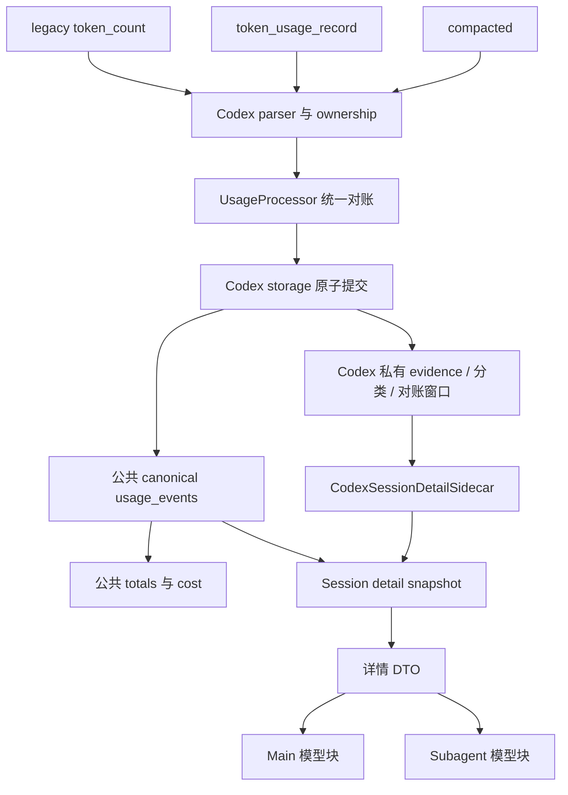

**Usagi Codex Compaction 适配与 Session Drawer 展示实施方案 v0.3**

状态：待实施。编写日期：2026-10-06。修订版本：v0.3。本文只定义施工方案，编写本文不授权修改代码、执行数据库迁移或提交 commit。

# 1. 文档目的

1. 将 Codex 中可确认的独立模型调用用量完整计入 Usagi，包括 Compaction 调用。
2. 使现代单次用量、Compaction 内嵌用量和 legacy counter 的重复证据只产生一份实际用量。
3. 保留旧 Codex session 中现有可恢复用量，并明确区分可测量和不可测量的 Compaction。
4. 将 Main 与每个 Subagent 的 Compaction 用量归属到各自线程、模型和推理深度。
5. 在 Session Drawer 的 Main 和 Subagent 模型明细中，分别展示 Compaction tokens。
6. 使增量扫描、重放、进程重启和账本重建得到一致的计量结果。

# 2. 代码现状与问题

## 2.1 代码与调查基线

| 项目 | 基线 |
| :--- | :--- |
| 仓库 | `/Users/hogee/Desktop/Usagi` |
| 分支 | `codex/compaction-adaptation-research` |
| Commit | `72a4334616972da90fdd612e928a9437e27521c0` |
| 发布版本 | `0.2.6` |
| 数据库 schema | `13`，`src/storage/migrations.rs` |
| Codex usage parser / canonical algorithm | `11 / 5`，`src/codex/normalization.rs` |
| 原始调查报告 | [Compaction 调研报告](/Users/hogee/.codex/visualizations/2026/10/05/01a10d68-2c8e-7c53-bf22-1d383b50186e/compaction-research/report.md) |
| 数字复核产物 | 同目录的 `long-session-response-ledger.csv`、`long-session-event-chain.csv`、`processor-replay-results.json` |

调查覆盖 1,526 个本机 JSONL；其中 215 条包含有效内嵌 usage 的 `compacted` 均能找到同文件、同 ID、同 usage 的独立 `token_usage_record`。未观察到顶层 response ID 跨文件重复，不据此断言未来重放不会重复。后续施工使用脱敏 fixture 固化调查时的数据，不读取持续增长的 live session 作为固定测试期望。

## 2.2 已确认的记录行为

| 证据 | 实际行为 | 实施含义 |
| :--- | :--- | :--- |
| `token_usage_record.usage` | 独立 response 的用量；现代 thread 累计增量与其对应 | 可建立一次调用身份 |
| `compacted.latest_token_usage_record` | 已观测有效样本与顶层记录相同 | 增加调用分类证据，不增加第二次调用 |
| `compaction_response_id` | 已观测有效样本匹配内嵌和顶层 `response_id` | 可关联 Compaction 分类与调用 |
| legacy `total_token_usage` | 现代远端 Compaction 样本中前后不变；本地压缩实现存在更新 legacy 的路径 | 不统一假设包含或排除 Compaction |
| legacy `last_token_usage` | 压缩后出现组件全零而 `total_tokens` 为上下文估计值 | 不可当成有效单次 response |
| `thread_token_usage` | 包含已观测现代 Compaction；resume 文件可能以历史累计开头 | 用于累计校验，不直接入账 |
| Subagent | 本机子线程有独立 response 和 Compaction，payload 的 `session_id` 可指向根会话 | 归属必须使用已解析的 owning thread |

Codex 本地安装版本为 `0.160.1`；调查使用的官方同版本源码定位在 `core/src/compact_remote_v2.rs`、`core/src/session/mod.rs`、`core/src/state/session.rs` 和 `core/src/compact.rs`。同版本源码不能证明与已安装二进制构建逐字一致，计量结论以本机记录优先。Magpie `internal/sessions/codex_usage.go` 仅作为对照实现，不作为计量真值。

## 2.3 当前调用链与缺口

| 文件 / 符号 | 现状 | 本次涉及点 |
| :--- | :--- | :--- |
| `src/codex/usage.rs`，`parse_line()` | 解析 `turn_context` 和 `event_msg.token_count` | 增加现代 usage 与 Compaction DTO |
| `src/codex/rollout.rs`，`classify_envelope()` | `compacted` 进入忽略分支 | 让新证据保留 ownership、时间与字节位置 |
| `src/codex/ingestion/usage_pipeline.rs`，`normalized_record()` | 未把顶层现代 usage 和 Compaction 送入计量状态机 | 接入统一处理链 |
| `src/codex/ingestion/usage_processor.rs`，`UsageProcessor` | legacy last / delta / turn compensation；累计下降开启新 baseline | 增加显式 response 与 legacy 覆盖关系 |
| `src/codex/normalization.rs`，`CodexRolloutAdapter::normalize()`；`src/usage/normalized.rs` | 统一六项计量维度与输入缓存口径 | 复用归一化，保留 cache write 未知语义 |
| `src/source/adapter.rs`，`CanonicalUsageEventWrite` | canonical 写入与 identity 冲突检查，无 Compaction 字段 | 复用写入、删除及 revision 原语 |
| `src/codex/storage/usage.rs` | canonical event、occurrence、checkpoint 原子提交 | 增加私有证据及替换补丁事务 |
| `src/codex/storage/rebuild.rs` | shadow epoch、carry、清理与切换 | 新私有数据参加生命周期 |
| `src/usage/aggregate.rs`，`SESSION_DETAIL_SQL` | 按线程、模型、effort 汇总 active canonical | 详情模型块增加分类统计投影 |
| `src/usage/ledger.rs` | detail 与 `data_revision` 在同一读事务内生成 | 注入同事务的 Codex 详情投影 |
| `src/codex/analytics.rs` | 存在 Codex 私有读侧与 error sidecar | 承接 Compaction 私有查询 |
| `src/api/query.rs`、`frontend/src/data/types.ts` | 模型 DTO 无 Compaction 统计 | 新增 nullable 详情字段 |
| `frontend/src/dashboard/session/SessionDetailDrawer.tsx`，`UsageReceipt` | Main/Subagent 共用 tokens 和 cost 展示 | 在 cost 前增加行 |

用户最初列出的 `src/usage/adapters/openai/codex.rs` 和 `src/usage/processor.rs` 在当前基线不存在；对应职责分别位于 `src/codex/normalization.rs` 和 `src/codex/ingestion/usage_processor.rs`，施工不重新创建旧路径。

本机长会话 `rollout-2026-09-17T12-43-12-01a0adad-044f-7cd0-b508-354762744ba5.jsonl` 有 48 个唯一 response：实际总量与 thread 末值均为 6,129,586，当前 parser / processor 重放结果为 5,812,597，差值 316,989 恰好为该次 Compaction。两次 Compaction 样本差值为 506,360。当前已确认缺陷为漏算；当前实现忽略新证据，未确认其已重复计算 Compaction。

## 2.4 必须同步适配的工程接点

| 当前定位 | 现有契约 | 目标契约所在小节 |
| :--- | :--- | :--- |
| `src/codex/ingestion/usage_pipeline.rs:394`、`:587`、`:786` | 三条分支逐条创建 processor，批内只传 legacy state | 4.3.4 |
| `src/codex/ingestion/usage_processor.rs:127`，`UsageEvent` | 提案要求 legacy current total | 4.3.2 |
| `src/codex/storage/usage.rs:131`、`:3293`；`rebuild.rs:1700` | source-state 固定列序列化、全值 CAS、27 项 fingerprint | 4.3.6 |
| `src/codex/storage/rebuild.rs:459` | private visibility 比较 Skills / quarantine | 4.4.6 |
| `src/codex/storage/usage.rs:414`、`:1024` | carry 只有原有阶段与 cursor | 4.2、4.4.4 |
| `src/codex/storage/rebuild.rs:322` | orphan 仅看 occurrence 是否存在 | 4.4.5 |
| `src/codex/storage/metadata.rs:216`、`:235`；`usage.rs:4152` | root / binding reconciliation 更新 active 并使 build member 失效 | 4.4.7 |
| `src/codex/storage/usage.rs:3796`，`codex_turns` | Turn 单调 upsert；closed Turn 不留在 source open state | 4.3.4、4.4.8 |
| `src/codex/storage/usage.rs:3074` | batch 强制 event / occurrence 等长 | 4.3.5 |

# 3. 目标架构与范围边界

## 3.1 目标效果与终态



Codex 负责理解来源格式、response 身份、累计域及 Compaction 分类。公共账本保存实际计量事件并继续统一计费。公共详情接口携带分类统计；公共查询层通过读侧接口调用 Codex 查询，不直接访问 Codex 私有表。

## 3.2 范围矩阵

| 维度 | 纳入范围 | 严格排除（严禁偷跑） |
| :--- | :--- | :--- |
| Codex ingestion | 解析、归属、去重、legacy 对账、重放和重建 | 修改 Codex 或 Magpie；原始 session 回写 |
| 数据库 | schema 14 的 Codex 私有证据表 | 给 `usage_events` 新增 Compaction tokens 列；全 provider 分类表 |
| 公共计量 | 复用六维归一化、canonical 写入与现有 cost | 新的计费公式；把缓存或 reasoning 再加一次 |
| 公共详情 | DTO 字段与同事务详情读侧接口 | summary API 增加 Compaction 指标；修改公共 `TokenTotals` |
| 前端 | Main/Subagent 每个模型块中的一行 | 顶部总览新增行；新图表、开关或独立 Compaction 页面 |
| 老格式 | 同一算法内按证据强度恢复现有计量 | v5 / v6 两套运行算法；运行时版本回退 |
| 工程 | 定向 fixture、迁移、API、UI 和 lifecycle 验证 | 无关重构、其他 provider parser 和数据库表变更 |

# 4. 架构契约与核心不变量

## 4.1 全局不变量

| 编号 | 契约与违规判定 |
| :--- | :--- |
| [INV-01] 单次计量 | 已确认的独立模型 response 按唯一身份计量一次；normal 和 Compaction 均纳入 canonical actual usage。同一调用多份记录形成多个 occurrence，不形成多个 canonical event。 |
| [INV-02] 身份与归属 | durable key 为 `(source='codex', owning_thread_id, response_id)`；epoch 只限定存储代次，不是逻辑调用身份。`session_id`、文件名、timestamp 和 token 数值均不能替代 owning thread 或 response ID。ancestor ownership 记录不计入子线程；同 key 的六维 usage 冲突必须产生诊断并阻止冲突补丁提交。 |
| [INV-03] 证据强度 | 顶层显式 usage 和内嵌显式 usage 同级，前者提供调用证据，Compaction marker 提供分类证据；缺少有效 usage 的 marker 只提供分类或未知证据。legacy last 和累计 delta 仅补未被显式证据覆盖的用量。 |
| [INV-04] 分离计量域 | `thread_token_usage` 为校验域；legacy counter 为 legacy 覆盖域；canonical 为实际调用域。显式 Compaction 未进入 legacy counter 时，不增加 legacy 的 `accounted`；确认进入时必须计入该覆盖域，禁止形成补偿事件再次计量。 |
| [INV-05] 累计与继承 | 首个现代累计值与首个单次 usage 的差额是 inherited baseline，不能入账；同域连续记录做向量增量校验。累计下降只重置相应域的 baseline，不删除已确认 response；跨文件累计末值不能相加。 |
| [INV-06] 分类不等于 EventKind | Compaction 保存为 Codex 私有 operation 分类；显式调用写 `EventKind::Normal`。`Recovered` 和 `TurnCompensation` 继续表达计量证据质量，不新增 `EventKind::Compaction`。 |
| [INV-07] 数量定义 | provider raw total 原样用于校验；canonical total 与 UI Total Tokens 均为归一化 `input + output`；cache read/write 包含在 input，reasoning 包含在 output。Compaction 展示值为已分类事件的 canonical total 子集，cost 使用这些事件现有的六维 billable usage，不二次相加。 |
| [INV-08] 未知语义 | 只有 `compaction_ready(active_epoch, active_parser_version)` 为真才允许已完成扫描的模型块返回零或精确值；readiness 为假时所有 Codex 模型块返回 `null`。一个模型块覆盖未解析 Compaction marker 时，`compaction_tokens=null`；所有相关 marker 已测量时返回其唯一调用 total 之和；已完成扫描范围内没有 marker 时返回 `0`。marker 缺少模型或 effort 时，将未知范围扩大到相应线程的可能匹配块，不能随机指定模型。 |
| [INV-09] 查询一致性 | 所有详情 totals、Compaction 投影与 `data_revision` 使用同一读事务、同一 active Codex epoch、同一 root、模型过滤和 `[start_ms,end_ms)` 时间范围；按 owning thread、model、effort 分组，不把子线程分类值附加到 Main self。 |
| [INV-10] 原子性 | canonical、occurrence、私有 facts、marker、对账窗口、processor carry 与 checkpoint 的新增、替换和删除一次提交。更新分类但 tokens 不变时也推进 `data_revision`。任何失败不得留下半份账目或提前推进 checkpoint。 |
| [INV-11] 稳定 payload | 同 key 多份证据六维一致时保留第一次持久化的 canonical 时间和模型维度，追加 provenance / 分类；外层 timestamp 不同不是 usage 冲突。重建按稳定 `(source_file_id,source_start_offset)` 顺序处理首次证据；同 epoch 重放复用既有绑定。 |
| [INV-12] 旧格式单算法 | v6 内使用现有 legacy last / delta / turn compensation 规则恢复缺少显式证据的区域；纯 legacy fixture 的 actual usage 与 v5 保持相等。对账不明确时禁止猜测 response 配对或按向量相等跨线程去重。 |
| [INV-13] 生命周期 | 私有数据与 canonical epoch 同时生成、carry、清理和切换；carry 仅接受 parser / algorithm 与目标代次一致的来源，不把 v5 事件复制成 v6 已完成来源；reader 不混用 building epoch。parser 升至 12、canonical algorithm 升至 6、schema 升至 14；通过现有 shadow rebuild 切换，不直接修改 active 历史事件。 |
| [INV-14] 展示位置 | 仅 Codex 模型块展示 `Compaction`，位于 `Estimated Cost` 正上方；Main 与 Subagent 复用同一 receipt 组件。`null` 显示 `—`，整数按现有 tokens 格式；其他 provider 不显示该行。 |
| [INV-15] 对账上下文 | 每个 chunk 的持久化依赖在处理前加载并冻结；同 chunk 新 fact、marker、窗口和删除集持续保存在同一个 processor 中。checkpoint / source state / 对账依赖 CAS 任一失效时，整批拒绝并重新规划，不能用旧上下文提交。 |
| [INV-16] 提案与累计分离 | `CanonicalUsageProposal` 不携带 legacy counter；previous / current total 只属于窗口与 legacy chain。`TurnState.accounted` 及 DB `accounted_*` 始终表示 legacy-counter 已覆盖量，不表示 canonical actual 总量。 |
| [INV-17] Durable proof | source carry JSON 与该 source 关联的对账证据参与 durable fingerprint；冻结、比较、carry 和提交使用同一编码。仅改变 reconciliation 状态必须使旧 proof 失效。 |
| [INV-18] 可恢复迁移与引用 | carry 采用 4.4.4 的分页阶段与持久 cursor；重放 / carry 临时引用采用有释放条件的 hold。fact 自身不能永久保护 orphan；有 hold 的事件在 cleanup 中不可删除，最终可激活 epoch 不得残留 hold。 |
| [INV-19] 批次计数 | canonical 提案、occurrence 和私有 evidence 写入分别计数；预算按 4.3.5 的总变更单元控制。无需新 canonical 的证据也消耗预算，不保留旧 event / occurrence 等长断言。 |
| [INV-20] Metadata 归属一致性 | root / source owner reconciliation 必须与现有 metadata commit 同事务；root-only 变更同步 active canonical 与 resolved / unresolved marker，binding 变更遵循 4.4.7 的整代 invalidation。build proof 失效后的私有数据不可按旧绑定激活。 |
| [INV-21] Closed Turn 更正 | 对已结束 Turn 的修正依赖持久化完整 Turn 快照与原补偿事件，并在同一补丁中更新窗口、覆盖账目和补偿集合。缺少输入或 CAS 不匹配不得单独发布 response 更正，重算不得复用旧补偿。 |

## 4.2 最终数据库模型

迁移文件为 `src/storage/schema/0014_codex_compaction_evidence.sql`。公共 `usage_events` 与 `codex_usage_event_occurrences` 的结构不变；新增以下四张 Codex 私有表、source carry 字段，并重建 carry manifest 表以扩展阶段与 cursor。DDL 中没有 token 副本的 fact 使用 FK 指向 canonical usage，窗口中的向量仅是对账证据，不参与 summary / cost 求和。

```sql
ALTER TABLE codex_usage_source_states ADD COLUMN reconciliation_state_json TEXT NOT NULL
    DEFAULT '{"version":1,"open_window_start_offset":null,"pending_response_ids":[],"modern_counter_domain":null,"modern_counter_total":null,"pending_evidence":[]}'
    CHECK (json_valid(reconciliation_state_json));

CREATE TABLE codex_usage_event_facts (
    source TEXT NOT NULL DEFAULT 'codex' CHECK (source = 'codex'),
    ledger_epoch INTEGER NOT NULL CHECK (ledger_epoch > 0),
    event_id TEXT NOT NULL CHECK (length(event_id) > 0),
    owning_thread_id TEXT NOT NULL,
    response_id TEXT CHECK (response_id IS NULL OR length(response_id) > 0),
    evidence_kind TEXT NOT NULL CHECK (evidence_kind IN ('explicit', 'legacy')),
    operation TEXT NOT NULL CHECK (operation IN ('response', 'compaction')),
    PRIMARY KEY (source, ledger_epoch, event_id),
    FOREIGN KEY (owning_thread_id) REFERENCES threads(thread_id),
    FOREIGN KEY (source, ledger_epoch, event_id)
        REFERENCES usage_events(source, source_epoch, event_id)
        ON DELETE CASCADE DEFERRABLE INITIALLY DEFERRED,
    CHECK ((evidence_kind = 'explicit' AND response_id IS NOT NULL)
        OR (evidence_kind = 'legacy' AND response_id IS NULL)),
    CHECK (operation <> 'compaction' OR evidence_kind = 'explicit')
);
CREATE UNIQUE INDEX codex_usage_response_identity_idx
    ON codex_usage_event_facts(source, ledger_epoch, owning_thread_id, response_id)
    WHERE response_id IS NOT NULL;

CREATE TABLE codex_compaction_markers (
    source TEXT NOT NULL DEFAULT 'codex' CHECK (source = 'codex'),
    ledger_epoch INTEGER NOT NULL CHECK (ledger_epoch > 0),
    source_file_id INTEGER NOT NULL,
    file_generation INTEGER NOT NULL CHECK (file_generation > 0),
    source_start_offset INTEGER NOT NULL CHECK (source_start_offset >= 0),
    source_end_offset INTEGER NOT NULL CHECK (source_end_offset > source_start_offset),
    owning_thread_id TEXT NOT NULL,
    root_session_id TEXT NOT NULL,
    occurred_at_ms INTEGER CHECK (occurred_at_ms IS NULL OR occurred_at_ms >= 0),
    model TEXT CHECK (model IS NULL OR length(model) > 0),
    reasoning_effort TEXT,
    response_id TEXT CHECK (response_id IS NULL OR length(response_id) > 0),
    resolved_event_id TEXT CHECK (resolved_event_id IS NULL OR length(resolved_event_id) > 0),
    unknown_reason TEXT CHECK (unknown_reason IN
        ('usage_missing', 'identity_missing', 'usage_invalid', 'time_missing', 'model_unresolved')),
    PRIMARY KEY (source, ledger_epoch, source_file_id, file_generation, source_start_offset),
    FOREIGN KEY (source) REFERENCES source_usage_epochs(source),
    FOREIGN KEY (source_file_id) REFERENCES codex_source_files(source_file_id) ON DELETE CASCADE,
    FOREIGN KEY (owning_thread_id) REFERENCES threads(thread_id),
    FOREIGN KEY (root_session_id) REFERENCES threads(thread_id),
    FOREIGN KEY (source, ledger_epoch, resolved_event_id)
        REFERENCES usage_events(source, source_epoch, event_id)
        DEFERRABLE INITIALLY DEFERRED,
    CHECK ((resolved_event_id IS NULL AND unknown_reason IS NOT NULL)
        OR (resolved_event_id IS NOT NULL AND unknown_reason IS NULL)),
    CHECK (resolved_event_id IS NULL OR response_id IS NOT NULL)
);
CREATE INDEX codex_compaction_marker_scope_idx
    ON codex_compaction_markers(ledger_epoch, root_session_id, owning_thread_id, occurred_at_ms);
CREATE INDEX codex_compaction_marker_response_idx
    ON codex_compaction_markers(ledger_epoch, owning_thread_id, response_id);

CREATE TABLE codex_usage_reconciliation_windows (
    source TEXT NOT NULL DEFAULT 'codex' CHECK (source = 'codex'),
    ledger_epoch INTEGER NOT NULL CHECK (ledger_epoch > 0),
    source_file_id INTEGER NOT NULL,
    file_generation INTEGER NOT NULL CHECK (file_generation > 0),
    source_start_offset INTEGER NOT NULL CHECK (source_start_offset >= 0),
    source_end_offset INTEGER NOT NULL CHECK (source_end_offset > source_start_offset),
    owning_thread_id TEXT NOT NULL,
    turn_key TEXT,
    state_json TEXT NOT NULL CHECK (json_valid(state_json)),
    PRIMARY KEY (source, ledger_epoch, source_file_id, file_generation, source_start_offset),
    FOREIGN KEY (source) REFERENCES source_usage_epochs(source),
    FOREIGN KEY (source_file_id) REFERENCES codex_source_files(source_file_id) ON DELETE CASCADE,
    FOREIGN KEY (owning_thread_id) REFERENCES threads(thread_id)
);
CREATE INDEX codex_usage_window_thread_idx
    ON codex_usage_reconciliation_windows(ledger_epoch, owning_thread_id, turn_key);

CREATE TABLE codex_usage_event_holds (
    source TEXT NOT NULL DEFAULT 'codex' CHECK (source = 'codex'),
    ledger_epoch INTEGER NOT NULL CHECK (ledger_epoch > 0),
    source_file_id INTEGER NOT NULL,
    file_generation INTEGER NOT NULL CHECK (file_generation > 0),
    event_id TEXT NOT NULL CHECK (length(event_id) > 0),
    hold_reason TEXT NOT NULL CHECK (hold_reason IN ('replay', 'carry')),
    PRIMARY KEY (source, ledger_epoch, source_file_id, file_generation, event_id),
    FOREIGN KEY (source_file_id) REFERENCES codex_source_files(source_file_id) ON DELETE CASCADE,
    FOREIGN KEY (source, ledger_epoch, event_id)
        REFERENCES usage_events(source, source_epoch, event_id)
        ON DELETE CASCADE DEFERRABLE INITIALLY DEFERRED
);
CREATE INDEX codex_usage_event_hold_event_idx
    ON codex_usage_event_holds(source, ledger_epoch, event_id);
```

所有未写 `DEFAULT` 的列由写入方显式提供，nullable 列的空值不代表零。`unknown_reason` 为 SQL `NULL` 或限定枚举；JSON 空字符串、缺字段和 SQL `NULL` 不混用。ownership 尚未解析的记录沿现有 ownership gap / anomaly 路径处理，不写入要求 owning thread 的私有行。窗口 `state_json` 必须反序列化为 4.3 的类型后验证，不存储 prompt、摘要、工具输出或完整 raw JSON。migration 不回填旧 usage 的推测分类，重建负责生成新 fact。

fact 的最终 trigger 定义如下，canonical 必须先于 fact 写入。窗口和 hold 无需额外 trigger。resolved marker 的最终绑定约束也由下列 trigger 实施。marker 的 FK 不级联删除 canonical 引用，替换事件时必须先更新或删除 marker 绑定；这使遗漏生命周期处理直接失败。

```sql
CREATE TRIGGER codex_usage_fact_owner_insert
BEFORE INSERT ON codex_usage_event_facts
WHEN NOT EXISTS (
    SELECT 1 FROM usage_events e
    WHERE e.source = NEW.source AND e.source_epoch = NEW.ledger_epoch
      AND e.event_id = NEW.event_id AND e.thread_id = NEW.owning_thread_id
)
BEGIN
    SELECT RAISE(ABORT, 'codex usage fact ownership mismatch');
END;
CREATE TRIGGER codex_usage_fact_owner_update
BEFORE UPDATE OF owning_thread_id,source,ledger_epoch,event_id ON codex_usage_event_facts
WHEN NOT EXISTS (
    SELECT 1 FROM usage_events e
    WHERE e.source = NEW.source AND e.source_epoch = NEW.ledger_epoch
      AND e.event_id = NEW.event_id AND e.thread_id = NEW.owning_thread_id
)
BEGIN
    SELECT RAISE(ABORT, 'codex usage fact ownership mismatch');
END;
CREATE TRIGGER codex_compaction_marker_binding_insert
BEFORE INSERT ON codex_compaction_markers
WHEN NEW.resolved_event_id IS NOT NULL AND NOT EXISTS (
    SELECT 1 FROM codex_usage_event_facts f JOIN usage_events e
      ON e.source=f.source AND e.source_epoch=f.ledger_epoch AND e.event_id=f.event_id
    WHERE f.source=NEW.source AND f.ledger_epoch=NEW.ledger_epoch
      AND f.event_id=NEW.resolved_event_id AND f.owning_thread_id=NEW.owning_thread_id
      AND f.response_id=NEW.response_id AND f.operation='compaction'
      AND e.root_session_id=NEW.root_session_id
)
BEGIN
    SELECT RAISE(ABORT, 'codex compaction marker binding mismatch');
END;
CREATE TRIGGER codex_compaction_marker_binding_update
BEFORE UPDATE OF source,ledger_epoch,resolved_event_id,owning_thread_id,response_id,root_session_id
ON codex_compaction_markers
WHEN NEW.resolved_event_id IS NOT NULL AND NOT EXISTS (
    SELECT 1 FROM codex_usage_event_facts f JOIN usage_events e
      ON e.source=f.source AND e.source_epoch=f.ledger_epoch AND e.event_id=f.event_id
    WHERE f.source=NEW.source AND f.ledger_epoch=NEW.ledger_epoch
      AND f.event_id=NEW.resolved_event_id AND f.owning_thread_id=NEW.owning_thread_id
      AND f.response_id=NEW.response_id AND f.operation='compaction'
      AND e.root_session_id=NEW.root_session_id
)
BEGIN
    SELECT RAISE(ABORT, 'codex compaction marker binding mismatch');
END;
CREATE TRIGGER codex_usage_bound_fact_update
BEFORE UPDATE OF source,ledger_epoch,event_id,owning_thread_id,response_id,operation
ON codex_usage_event_facts
WHEN EXISTS (
    SELECT 1 FROM codex_compaction_markers m
    WHERE m.source=OLD.source AND m.ledger_epoch=OLD.ledger_epoch
      AND m.resolved_event_id=OLD.event_id
      AND (NEW.source<>OLD.source OR NEW.ledger_epoch<>OLD.ledger_epoch
        OR NEW.event_id<>OLD.event_id OR NEW.owning_thread_id<>m.owning_thread_id
        OR NEW.response_id IS NOT m.response_id OR NEW.operation<>'compaction')
)
BEGIN
    SELECT RAISE(ABORT, 'codex bound compaction fact mutation');
END;
CREATE TRIGGER codex_usage_bound_fact_delete
BEFORE DELETE ON codex_usage_event_facts
WHEN EXISTS (
    SELECT 1 FROM codex_compaction_markers m
    WHERE m.source=OLD.source AND m.ledger_epoch=OLD.ledger_epoch
      AND m.resolved_event_id=OLD.event_id
)
BEGIN
    SELECT RAISE(ABORT, 'codex bound compaction fact deletion');
END;
```


carry manifest 的最终 DDL 与迁移定义如下；旧表列全部保留，新 cursor 默认 `NULL`。现有进行中的 build 由版本升级进入原有 abandon / rebuild 流程，不能从旧 parser 的 carry 阶段直接跳到新算法完成状态。

```sql
ALTER TABLE codex_usage_build_sources RENAME TO codex_usage_build_sources_v13;
CREATE TABLE "codex_usage_build_sources" (
    build_epoch INTEGER NOT NULL CHECK (build_epoch > 0),
    source_file_id INTEGER NOT NULL,
    target_parser_version INTEGER NOT NULL CHECK (target_parser_version >= 0),
    expected_file_generation INTEGER NOT NULL CHECK (expected_file_generation > 0),
    expected_device_id INTEGER NOT NULL CHECK (expected_device_id >= 0),
    expected_inode INTEGER NOT NULL CHECK (expected_inode >= 0),
    expected_owning_thread_id TEXT,
    expected_root_session_id TEXT,
    active_committed_offset INTEGER NOT NULL CHECK (active_committed_offset >= 0),
    active_guard_hash BLOB,
    active_state_fingerprint BLOB,
    required_generation INTEGER NOT NULL CHECK (required_generation > 0),
    required_through_offset INTEGER NOT NULL CHECK (required_through_offset >= 0),
    observed_raw_size INTEGER NOT NULL CHECK (observed_raw_size >= 0),
    raw_tail_status TEXT NOT NULL CHECK (raw_tail_status IN ('unverified','none','half_line')),
    raw_tail_start_offset INTEGER CHECK (raw_tail_start_offset >= 0),
    membership_reason TEXT NOT NULL CHECK (membership_reason IN ('active_contributor','present_at_build_start','both','discovered_during_build')),
    completion_status TEXT NOT NULL CHECK (completion_status IN ('pending','rebuilt','carried','blocked','quarantined')),
    completion_error_code TEXT,
    completed_generation INTEGER CHECK (completed_generation > 0),
    completed_through_offset INTEGER CHECK (completed_through_offset >= 0),
    carry_from_epoch INTEGER CHECK (carry_from_epoch >= 0),
    carry_phase TEXT NOT NULL CHECK (carry_phase IN ('none','occurrences','facts','markers','windows','turns','anomalies','finalize')),
    carry_after_start_offset INTEGER CHECK (carry_after_start_offset >= 0),
    carry_after_turn_key TEXT,
    carry_after_anomaly_id TEXT,
    carry_after_fact_event_id TEXT CHECK (carry_after_fact_event_id IS NULL OR length(carry_after_fact_event_id)>0),
    carry_after_marker_start_offset INTEGER CHECK (carry_after_marker_start_offset>=0),
    carry_after_window_start_offset INTEGER CHECK (carry_after_window_start_offset>=0),
    created_at_ms INTEGER NOT NULL CHECK (created_at_ms >= 0),
    updated_at_ms INTEGER NOT NULL CHECK (updated_at_ms >= 0),
    PRIMARY KEY (build_epoch, source_file_id),
    FOREIGN KEY (source_file_id) REFERENCES "codex_source_files"(source_file_id),
    CHECK (required_generation = expected_file_generation),
    CHECK (required_through_offset <= observed_raw_size),
    CHECK ((raw_tail_status='unverified' AND raw_tail_start_offset IS NULL) OR (raw_tail_status='none' AND raw_tail_start_offset IS NULL AND required_through_offset=observed_raw_size) OR (raw_tail_status='half_line' AND raw_tail_start_offset=required_through_offset AND required_through_offset<observed_raw_size)),
    CHECK ((completion_status IN ('pending','blocked','quarantined') AND completed_generation IS NULL AND completed_through_offset IS NULL) OR (completion_status IN ('rebuilt','carried') AND completed_generation=required_generation AND completed_through_offset IS NOT NULL AND completed_through_offset>=required_through_offset)),
    CHECK ((completion_status IN ('blocked','quarantined')) = (completion_error_code IS NOT NULL)),
    CHECK (completion_status <> 'quarantined' OR expected_root_session_id IS NOT NULL),
    CHECK ((carry_phase='none' AND carry_from_epoch IS NULL AND carry_after_start_offset IS NULL AND carry_after_turn_key IS NULL AND carry_after_anomaly_id IS NULL AND carry_after_fact_event_id IS NULL AND carry_after_marker_start_offset IS NULL AND carry_after_window_start_offset IS NULL) OR (carry_phase<>'none' AND carry_from_epoch IS NOT NULL))
);
INSERT INTO codex_usage_build_sources(build_epoch,source_file_id,target_parser_version,expected_file_generation,expected_device_id,expected_inode,expected_owning_thread_id,expected_root_session_id,active_committed_offset,active_guard_hash,active_state_fingerprint,required_generation,required_through_offset,observed_raw_size,raw_tail_status,raw_tail_start_offset,membership_reason,completion_status,completion_error_code,completed_generation,completed_through_offset,carry_from_epoch,carry_phase,carry_after_start_offset,carry_after_turn_key,carry_after_anomaly_id,created_at_ms,updated_at_ms)
SELECT build_epoch,source_file_id,target_parser_version,expected_file_generation,expected_device_id,expected_inode,expected_owning_thread_id,expected_root_session_id,active_committed_offset,active_guard_hash,active_state_fingerprint,required_generation,required_through_offset,observed_raw_size,raw_tail_status,raw_tail_start_offset,membership_reason,completion_status,completion_error_code,completed_generation,completed_through_offset,carry_from_epoch,carry_phase,carry_after_start_offset,carry_after_turn_key,carry_after_anomaly_id,created_at_ms,updated_at_ms FROM codex_usage_build_sources_v13;
DROP TABLE codex_usage_build_sources_v13;
CREATE INDEX codex_usage_build_sources_status_idx
    ON codex_usage_build_sources(build_epoch, completion_status);
```

## 4.3 类型与接口

### 4.3.1 Codex 证据类型

在现有 Codex parser / processor 模块内定义类型，不将 provider DTO 暴露给公共 canonical 写接口。

```rust
struct ResponseUsageEvidence {
    response_id: String,
    thread_id: Option<String>,
    session_id: Option<String>,
    turn_id: Option<String>,
    usage: UsageValue,
    thread_token_usage: UsageValue,
}

struct CompactionEvidence {
    compaction_response_id: Option<String>,
    latest_token_usage_record: Option<ResponseUsageEvidence>,
}

enum CodexOperation { Response, Compaction }
enum EvidenceKind { Explicit, Legacy }
```

`UsageRecord` 新增 `ResponseUsage` 和 `Compacted` 两个 variant，均携带现有 `Ownership`、`timestamp_ms`、`start_offset`、`end_offset` 与相应 evidence。DTO 读取本机实际 schema：顶层类型为 `token_usage_record`，字段位于 `payload`；`compacted` 的关联字段位于 `payload`。未知额外字段不改变现有 parser 的宽容策略；无效必需 usage 进入已有 gap / anomaly 机制。归一化遵循 [INV-07]，缺失 `cache_write_input_tokens` 保留未知，不在内部改成已知零。

identity hash 使用既有 hash 工具、长度前缀编码 `('codex-response-v6', owning_thread_id, response_id)`；不编码时间、token 数或物理文件。legacy 事件继续使用现有内容身份算法，并受新的算法 fingerprint 管理。

### 4.3.2 对账窗口与补丁

每个 owning `token_count` 形成一个窗口。窗口从上一个有效 counter anchor 之后开始，到本条记录结束；首次 anchor 之前的区间没有可减的历史 baseline。现代证据按 owning turn 和物理顺序关联，跨文件重放先合并 response identity，不能按根 session ID 合并计量。

```rust
struct LegacyReconciliationWindow {
    version: u8, // 固定为 1
    previous_total: UsageValue,
    current_total: UsageValue,
    last_usage: UsageValue,
    explicit_response_ids: Vec<String>,
    legacy_covered_response_ids: Vec<String>,
    proposal_event_ids: Vec<String>,
    turn_accounted_before: NormalizedTokenUsage,
    chain_state: ChainState,
    closed: bool,
}

struct CanonicalUsageProposal {
    event_id: String,
    kind: EventKind,
    occurred_at_ms: i64,
    thread_id: String,
    root_session_id: String,
    turn_key: Option<String>,
    model: String,
    reasoning_effort: Option<String>,
    usage: NormalizedTokenUsage,
}

struct ReconciliationPatch {
    delete_event_ids: Vec<String>,
    events: Vec<CanonicalUsageProposal>,
    occurrences: Vec<Occurrence>,
    facts: Vec<UsageEventFact>,
    marker_updates: Vec<CompactionMarkerWrite>,
    window_updates: Vec<LegacyWindowWrite>,
    turn_upserts: Vec<PersistedTurnSnapshot>,
    turn_rewrites: Vec<TurnRewrite>,
    anomalies: Vec<Anomaly>,
}
```

`UsageValue` 使用 tagged JSON：`{"kind":"missing"}`、`{"kind":"invalid"}` 或 `{"kind":"valid","usage":{...}}`；valid 内部字段直接采用 `NormalizedTokenUsage` 的 `input_tokens`、`cached_tokens`、`cache_write_tokens`、`output_tokens`、`reasoning_tokens`、`total_tokens`，cache write 可为 `null`。`chain_state` 序列化为 `{"kind":"continuous"}` 或 `{"kind":"interrupted","reason":"..."}`，reason 使用现有 `GapKind` 的 snake_case；`turn_accounted_before` 使用上述归一化向量。窗口所属 source、epoch、thread、turn 和字节范围来自表列，不在 JSON 中存第二份。所有 ID 列表去重并按稳定顺序序列化；`proposal_event_ids` 仅指向该窗口仍生效的 legacy 事件。窗口与 turn carry 共同保存 legacy 覆盖账目。

source carry 的 `reconciliation_state_json` 对应 `ReconciliationCarry`，最终字段固定为：`version: u8`（值为 1）、`open_window_start_offset: Option<u64>`、`pending_response_ids: Vec<String>`、`modern_counter_domain: Option<(String, Option<String>)>`（payload thread / session 标识，只用于校验域）、`modern_counter_total: Option<NormalizedTokenUsage>`、`pending_evidence: Vec<PendingUsageEvidence>`。`PendingUsageEvidence` 保存未完成模型 / 时间解析的 owning `UsageRecord::ResponseUsage` 或 `Compacted`，及该记录发生时的 `model: Option<String>`、`reasoning_effort: Option<String>`；仅允许这两种 variant，不保存内容正文。已完成绑定移出 pending；待解析证据在所属 turn 完结仍不可提交时记录诊断并关闭 pending，不套用后续 turn context。反序列化未知版本是 parser rebuild 条件，不是 silent default。现代累计比较不跨 `modern_counter_domain`；切域重新建立 baseline。

`CanonicalUsageProposal` 替换 processor 原 `UsageEvent`，不保留旧提案类型别名或虚构 counter。`src/codex/ingestion/usage_commit.rs` 将其转换为现有 `UsageEventWrite` / `CanonicalUsageEventWrite`，cost 仍在现有转换路径计算。`UsageEventFact` 对应 fact 表全部业务列；`CompactionMarkerWrite` 和 `LegacyWindowWrite` 对应各自表列。它们仅供 Codex ingestion / storage 使用。`UsageProcessor` 继续为纯状态机：storage 层将已有 response 绑定和受影响窗口加载到 processor 的上下文，processor 返回补丁，内部不执行 SQL。一次正常追加只读取当前线程受影响的窗口和 response 绑定，不扫描整张账本。

新增异常码：`ReconciliationPatchTooLarge`、`ResponseUsageConflict`、`ResponseOwnershipMismatch`、`CompactionIdentityMismatch`、`LegacyCoverageAmbiguous`、`ThreadUsageMismatch`。response / ownership / compaction identity 冲突、覆盖歧义与超大补丁阻止该窗口补丁，进入现有 source quarantine / build failure 流程；thread 累计不匹配记录诊断并断开该累计校验链，已验证的单次 usage 仍可入账。不得用猜测性 recovered delta 消除异常。

### 4.3.3 公共详情投影

在 `src/usage/aggregate.rs` 定义读侧契约，与现有 `SessionErrorSidecar` 使用同类边界：

```rust
pub struct SessionCompactionProjection {
    pub thread_id: String,
    pub model: String,
    pub reasoning_effort: Option<String>,
    pub compaction_tokens: Option<i64>,
}

pub trait SessionDetailSidecar: Send + Sync {
    fn compaction_usage(
        &self,
        connection: &Connection,
        range: TimeRange,
        filter: &UsageFilter,
        detail: &SessionDetail,
    ) -> Result<Vec<SessionCompactionProjection>, AggregateError>;
}
```

`src/codex/analytics.rs` 实现无状态 `CodexSessionDetailSidecar`。仅返回 `detail.source == "codex"` 的已有模型块，按 `(thread_id,model,reasoning_effort)` 唯一；API 层构造该 sidecar，不增加应用全局 registry。`UsageLedger::session_detail_snapshot()` 与 `session_detail_with_project_snapshot()` 增加 `detail_sidecars: &[&dyn SessionDetailSidecar]` 参数，在当前 read transaction 内合并投影；非 API 调用点显式传 slice，直接使用 `AggregateReader` 的内部默认字段为 `None`。

`MainModelUsage`、`SubagentModelUsage`、两类 API DTO 各增加 sibling 字段 `compaction_tokens: Option<i64>`；JSON 始终包含该 key，值为非负安全整数或 `null`。不放进 `usage`，不增加到 `TokenTotals` 或共享前端 `UsageDto`。投影 key 重复、指向不存在的块、tokens 超过块 total 均报 `AggregateError`，不能静默合并。

```typescript
// 两类模型 DTO 均新增这一字段。
compaction_tokens: number | null;

// 共用 UsageReceipt 的新增入参。
compactionTokens: number | null;
showCompaction: boolean;
```

前端 DTO parser 使用现有 nullable safe integer 校验；缺 key 不隐式转为零。后端和前端作为同一版本发布，缺 key 的响应视为协议不完整。`showCompaction` 由对应 Main / Subagent 的 `source === 'codex'` 决定。

### 4.3.4 Pipeline 对账上下文与批内状态

`UsagePipelinePlan` 增加 `reconciliation_context: ReconciliationContext`；`UsageSourceState` 增加 `reconciliation_carry: ReconciliationCarry`；`SourceStateProof` 沿 processor state 携带它。一次 chunk 使用一个 processor，普通、replay-prefix 和 session-first 三条处理路径均调用同一逐条应用接口，移除逐条 `UsageProcessor::new(...).process([record])` 模式。

```rust
struct ResponseKey { owning_thread_id: String, response_id: String }
struct WindowKey { source_file_id: i64, file_generation: i64, start_offset: u64 }
struct ResponseBinding {
    proposal: CanonicalUsageProposal,
    fact: UsageEventFact,
}
struct ReconciliationRequest {
    response_keys: Vec<ResponseKey>,
    owning_turn_keys: Vec<(String, Option<String>)>,
}
struct PersistedTurnKey {
    source_file_id: i64,
    file_generation: i64,
    turn_key: String,
}
struct PersistedTurnSnapshot {
    key: PersistedTurnKey,
    owning_thread_id: String,
    state: TurnState,
    status: PersistedTurnStatus,
    ended_at_ms: Option<i64>,
    end_offset: Option<u64>,
    quality_status: String,
    state_through_offset: u64,
}
enum PersistedTurnStatus { Open, Completed, Aborted, Failed }
struct AffectedTurn {
    snapshot: PersistedTurnSnapshot,
    compensation_events: Vec<CanonicalUsageProposal>,
    compensation_occurrences: Vec<Occurrence>,
}
struct TurnRewrite {
    expected: PersistedTurnSnapshot,
    replacement: PersistedTurnSnapshot,
}
struct ReconciliationContext {
    bindings: BTreeMap<ResponseKey, ResponseBinding>,
    windows: BTreeMap<WindowKey, LegacyReconciliationWindow>,
    markers: Vec<CompactionMarkerWrite>,
    affected_turns: BTreeMap<PersistedTurnKey, AffectedTurn>,
    expected_fingerprint: Vec<u8>,
    request: ReconciliationRequest,
}
```

`ResponseKey` / `WindowKey` 实现稳定排序，request 去重排序。`bindings` 含同 key 的 canonical payload；`windows` 含受影响 turn 全部可复算窗口及其关联 response binding；`markers` 包含请求 response ID 的未解析 marker；`affected_turns` 加载 request 命中的 open / closed Turn 完整持久化快照与其当前补偿事件、物理 occurrence。`PersistedTurnKey` 实现稳定排序，epoch 来自 plan。快照覆盖 `codex_turns` 的业务列，向量 fingerprint 由相应向量按既有算法重建并校验，`quality_status` 只允许 `complete` / `partial` / `conflict`；不以 open-turn reader 代替 closed-turn 加载。找不到的请求 key 也纳入 proof，以检测处理期间插入的新 binding。每个加载窗口的表列位置与 turn 信息作为 window key / 上下文保存，不丢弃物理配对范围。preflight 与 processor 共用现有 turn key 生成规则；request 中的 turn key 不是另一份 raw turn ID 算法。

冻结执行次序：consumer 先调用现有 `load_usage_scan_state*()` 取得 basic plan 和 carry；基于固定 raw view 与已有 metadata ownership 分类，将受当前 byte / line budget 限制的完整行解码一次并缓存在当前 chunk，形成 request；然后调用 `load_usage_reconciliation_context(basic_plan, request)`，在一个读事务中重新校验 basic checkpoint / source proof，批量加载请求依赖，形成最终 plan。basic proof 已变化时重新规划，不继续使用旧缓存结果。raw file fixed-view guard 仍沿用当前校验。

最终 plan 送入 `UsagePipeline::process_chunk()` 后无 SQL 调用。processor 从 context 初始化 binding / marker / window map，同 chunk 的新 evidence、classification 和 proposal 替换立即更新这些 map，后续记录读取更新后的 map。接口固定为 `UsageProcessor::new(context, source_state, reconciliation_context)`、`try_process_record(record, remaining_write_units)` 与 `finish()`；`try_process_record()` 返回 `Applied` 或 `BudgetExceeded`，后者不得改变状态、补丁或 offset。错误继续通过 processor anomaly / needs-rebuild 结果表达，不让纯 processor 依赖 SQL 错误类型。`RecordApplyOutcome` 固定为 `Applied` / `BudgetExceeded`；方法返回它，`finish(self)` 返回 `ProcessResult`。`ProcessResult` 和 `UsageSourceCommitDto` 的 `events` / `occurrences` / `anomalies` 独立向量替换为单个 `patch: ReconciliationPatch`，保留 updated state、skills 与边界字段；原 `closed_turns` / `open_turn` 写入集合转换到 patch 的 `turn_upserts`，不保留第二份 Turn 写入来源。storage `UsageSourceCommit` 使用 `patch: ReconciliationPatchWrite`，与 patch 操作对应，但 event 转换成已有 `UsageEventWrite`、occurrence 转换成 `UsageOccurrenceWrite`、anomaly 转换成 `UsageAnomalyWrite`，Turn snapshot / rewrite 的 expected 与 replacement 转换为完整 `UsageTurnWrite`。原始向量不与 patch 并存；所有计数从最终 patch 派生。

consumer 负责 raw 解码和 request；storage 负责 context 加载与提交 CAS；processor 负责纯对账和批内 map。不能将整张 response 表预加载进每个 plan。正常追加仅加载 request 指定的线程 / turn / response 闭包；同一个请求包含的 marker 或窗口跨 source file 时，其对应物理主键一起进入 proof。

### 4.3.5 补丁计数与 batch budget

删除 `UsageSourceCommitDto`、`UsageSourceCommit` 中旧 `candidate_count` 字段与校验，改为 `canonical_event_count`、`occurrence_count`、`evidence_write_count`、`write_unit_count`。前三项分别等于去重后的 canonical 提案数、occurrence upsert 数以及 fact / marker / window / hold / Turn upsert 或 rewrite 数；`write_unit_count` 是前三项之和加显式删除操作数。计数在 DTO 中使用 `u64`，storage write 使用经溢出校验的 `i64`；均为非负整数，所有求和 checked arithmetic。

同表同主键的批内多次写入折叠为最终操作；先 insert 后 delete 且无需保留的行折叠为零操作。删除按每个主键计一单元，retarget occurrence 算一次 upsert，不把被 CASCADE 删除的 fact 再重复计数。source carry、checkpoint 与既有 anomaly 写入保持现有 line / byte 约束；Turn upsert / rewrite 每个主键计一 evidence 写入单元，所有新增可变长 evidence 均纳入 `evidence_write_count`。

`MAX_BATCH_CANDIDATES` 与 storage 的 `MAX_USAGE_BATCH_CANDIDATES` 更名为 `MAX_BATCH_WRITE_UNITS`、`MAX_USAGE_BATCH_WRITE_UNITS`，值仍为 2048；限制 source batch 与 thread group 总 `write_unit_count`，普通 byte / line 规则不变。超大行仍单条独占且不产生 canonical / occurrence；有既有 open Turn 且该行产生 `Gap::Oversized` 时，只允许为当前 source generation 保存该 open Turn 的唯一 upsert，要求 `chain_state=Interrupted(Oversized)`、`parser_gap=true`、`quality_status=partial` 且 `state_through_offset` 等于提交后的 checkpoint，该 upsert 计 1 个 write unit。其余超大行继续允许原零写入独占进度，包括 `ReplayedAncestor`；超大行提交禁止混入 canonical / occurrence、fact、marker、window、hold、Turn rewrite 或任何 delete。marker-only 和 window-only chunk 允许 canonical / occurrence count 为零，但必须计 evidence writes。occurrence 指向本批新 canonical 或 DB 已有 canonical，二者不要求数量相等。

某条记录会超出剩余 budget 时保留其前一状态并结束当前 chunk，下一批重新处理该记录。若空批处理单条记录仍超过 2048 单元，则记录 `ReconciliationPatchTooLarge` 并按现有 source quarantine / build failure 处理，不无限重试，不拆开有原子要求的补丁。计量更正的显式 delete / upsert 必须共享该规则。

### 4.3.6 Source proof 与 expected-state CAS

`UsageSourceStateWrite` 增加 `reconciliation_state_json: String`，由 `ReconciliationCarry` 的固定字段顺序、compact JSON 和稳定 ID 排序序列化；reader 拒绝字段非法或 version 不支持的状态。`usage_consumer.rs::pipeline_state()` 与 `usage_commit.rs::source_state()` 双向转换必须保留全部字段。`read_usage_source_state()`、source-state upsert、expected-state 全值比较及 carry source-state copy 同步增加此列。

`active_state_fingerprint()` 的 source SELECT 由 27 项扩展为 28 项，最后一项是该 JSON；hash domain 改为 `usage-source-state-proof-v3`，保持现有类型 tag 与长度编码。再追加该 source generation 的私有证据摘要：由 occurrence / resolved marker 可达的 fact、marker、窗口、hold、完整 Turn 快照与补偿事件，按表 tag 与主键排序编码业务列；JSON 列使用同一 canonical serialization。不要纳入 `updated_at_ms` 等非语义更新时间。冻结 build member、`verify_carry_db_proof()`、finalize carry 与重新规划都调用这一函数，不能只在 freeze 阶段追加 JSON。

`ReconciliationContext.expected_fingerprint` 使用独立 domain `codex-reconciliation-context-v1`，覆盖 request 及其依赖的 canonical binding / fact / marker / window、完整 Turn snapshot 与补偿事件 / occurrence、相关 Thread / source metadata 绑定，包括查询为空的 key。提交在 write transaction 内以相同 request 重新计算并对比；不一致走现有 stale proof / retry 流程。它保护跨 source 的 response / window 依赖，不用 source carry JSON 代替跨 source CAS。source batch 携带完整 request 与 expected fingerprint；批内变更不是 expected proof 的一部分，CAS 比较的是处理前快照。

## 4.4 对账状态转移与算法

### 4.4.1 Response 与分类状态

| 当前状态 | 触发证据 | 目标状态 / 校验 |
| :--- | :--- | :--- |
| 无 response | 有效顶层 usage | 创建显式事件与 `operation=response` fact |
| 无 response | 有效内嵌 usage 且关联 ID 一致 | 创建显式事件与 `operation=compaction` fact，绑定 marker |
| 无 response | marker 只有 ID | 保存 unresolved marker，等待同 key usage |
| 已有显式 response | 同 key、相同 usage | 复用 event，增加 occurrence；按 [INV-11] 比较 |
| 已有显式 response | marker 指向同 key | fact 升级为 `compaction`，绑定 marker |
| unresolved marker | 同 key 有效 usage | 绑定事件并清除 `unknown_reason` |
| 已有显式 response | 同 key、冲突 usage / owning thread | 拒绝冲突补丁，按 4.3.2 诊断 |
| legacy 已入账 | 唯一覆盖证据确认其被显式 response 替代 | 原子删除或缩减 legacy 事件并新增显式事件 |

只有 usage 没有合法 response identity 的内嵌记录不可合成 response ID；marker ID 与内嵌 ID 不同不可选取其中之一。没有 marker 的顶层记录只证明实际 usage，不能凭其 token 大小推断它是 Compaction。缺失外层时间或 owning 模型时保留证据并延迟该事件提交，不能虚构时间、模型或套用 parent 模型。

### 4.4.2 Legacy 窗口覆盖规则

所有向量运算使用现有六维归一化与 checked arithmetic。覆盖证明对其余五个已知维度逐项比较；cache write 使用下表，不能把未知转成零。双方均为 `None` 只证明「一致的未知状态」，不证明实际 cache write 数量；两边 knownness 不同不能形成完整覆盖证明。

| 左侧 cache write | 右侧 cache write | 覆盖判定 |
| :--- | :--- | :--- |
| `None` | `None` | 其余维度一致时可建立等未知状态的覆盖关系，结果继续 `None` |
| `Some(a)` | `Some(b)` | 仅 `a == b` 可通过 |
| `None` | `Some(0)` 或 `Some(n)` | 不可证明覆盖 |
| `Some(0)` 或 `Some(n)` | `None` | 不可证明覆盖 |

加减法继续传播 `None`；混合 knownness 若导致覆盖无法唯一确认，走 `LegacyCoverageAmbiguous`，不发布 delta 猜测。设有效累计增量为 `D`，有效 last 为 `L`，窗口内未绑定的显式 Compaction 集合为 `C`。

| 窗口证据 | 唯一处理结果 |
| :--- | :--- |
| 无显式证据 | 调用现有 legacy 推导，保存其 proposal 与覆盖窗口 |
| 正常显式 usage 与同 owning turn 内紧邻的 legacy last 一致 | 正常调用标记 legacy-covered；legacy last proposal 被该调用替换，counter 和 legacy accounted 正常前进 |
| `D == L`，且 Compaction 已发生、`D` 未覆盖它 | Compaction 只记 actual；不加入 legacy accounted |
| `D == L + ΣC` 且配对唯一 | `C` 标记 legacy-covered；推进 legacy accounted 并消除对应 turn residual |
| last 无效 / 缺失，`D` 与唯一显式覆盖集合一致 | 用显式集合替代该 recovered delta |
| `D` 可由已证明覆盖的显式集合与一个有效 legacy residual 精确分解 | 仅保留 residual proposal；显式集合写独立事件 |
| 累计完全不变且 last 是组件零、total 非零估计 | 保留 baseline，不产生单次用量 |
| legacy 累计下降 | 走现有 reset / baseline 规则；已建立的 response 身份与 actual 不清空 |
| 不能唯一配对或分解 | `LegacyCoverageAmbiguous`，阻止该窗口的猜测性补丁 |

「紧邻」表示同 ownership、同 turn、两证据之间没有其他 model completion、legacy usage 或 ownership / parser gap；忽略 rate limit 等不参与计量的消息。相同向量的多个 response 不能借此互相去重。若只有 last、没有可用 D，则只确认 last 的唯一配对；Compaction 暂不标记 legacy-covered，关闭该窗口的 turn compensation，直至后续 anchor 提供覆盖证明。

首次 anchor 无 previous total 时沿用现有 legacy 首次记录规则；若有唯一 last 配对只替换其 proposal，不能从 current total 减掉整个历史累计。现代 thread 累计的 inherited baseline 不用于补足 legacy 缺口。

`TurnState.accounted` 和 `codex_turns.accounted_*` 不改名，其 v6 语义固定为 legacy-covered usage 与 legacy-only proposals 的合计；`accounted_candidate_count` 表示这些覆盖项的数量，不是 batch event 数。turn compensation 使用该覆盖合计，不能使用所有 actual usage 的合计。对于没有显式覆盖歧义的纯 legacy turn，现有 compensation 条件和异常保持不变。

### 4.4.3 晚到证据、持久化与重放

同一窗口内允许「先 legacy、后显式」；显式记录到达时通过 owning turn、物理相邻关系及既有窗口重新验证 4.4.2。匹配必须唯一。已关闭窗口的晚到关联只接受可复核的既有窗口证据，不做跨 turn 的向量搜索。已关闭 Turn 的 durable 输入与补偿更正统一遵循 4.4.8，不读取 prompt 历史。

补丁差分以原窗口 `proposal_event_ids` 为删除集、重算 proposal 为新增集。storage 先处理所有引用旧事件的 marker 和 occurrence，再调用 `delete_usage_events_no_revision()`，通过现有 canonical writer 写入新事件，更新绑定与 checkpoint，最后统一推进 revision。一个 legacy 行仍最多绑定一个 residual 事件；被显式完全覆盖的行没有 canonical occurrence，其消费证明保存在窗口和 checkpoint，显式事件的 occurrence 使用显式记录自身的字节范围。

顶层和内嵌都存在时，两条物理行各自可形成指向同 event 的 occurrence；marker 保留其物理来源。只有 marker / 只有顶层 / parser batch 中途暂停均能通过相同机制续扫。source state 持有开放窗口的 key 与必要 pending identity，完整关闭窗口放入窗口表，不把全部历史 response 放进 carry。

local replay、carry 和 orphan 的引用与释放遵循 4.4.4、4.4.5。inactive cleanup 先删 marker / 窗口 / hold，再删 occurrence / fact / canonical；epoch 切换的可见性判定遵循 4.4.6。

### 4.4.4 Resumable carry 阶段与 cursor

`UsageCarryPhase` 固定为 `None → Occurrences → Facts → Markers → Windows → Turns → Anomalies → Finalize → None`；`None` 只表示未开始或已完成。每页继续使用现有 `CARRY_PAGE_ROWS`，不新增配置。phase 与当前 phase cursor 在同一 copy transaction 中 CAS，读取 `PAGE_ROWS + 1` 判定下一页；空阶段必须推进，不停留重试。

| 阶段 | 数据选择 / 顺序 | 持久 cursor | 完成后 |
| :--- | :--- | :--- | :--- |
| `Occurrences` | 原有 occurrence / skill 物理 offset 页，先 copy canonical 再 occurrence | `carry_after_start_offset` | `Facts` |
| `Facts` | 当前 source occurrence 或 resolved marker 可达的 fact，按 `event_id` 去重排序；如 canonical 尚不存在则先 copy canonical，并建立 `carry` hold | `carry_after_fact_event_id` | `Markers` |
| `Markers` | 当前 source generation 全部 marker，含无 occurrence 的 unresolved 行；resolved 行要求目标 fact 已存在 | `carry_after_marker_start_offset` | `Windows` |
| `Windows` | 当前 source generation 全部窗口，包括没有 canonical proposal 的窗口 | `carry_after_window_start_offset` | `Turns` |
| `Turns` | 保持原 turn 页选择 | `carry_after_turn_key` | `Anomalies` |
| `Anomalies` | 保持原 anomaly 页选择 | `carry_after_anomaly_id` | `Finalize` |
| `Finalize` | 验证 frozen proof，复制含 reconciliation JSON 的 source state，释放该 source 的 carry hold 并执行 orphan cleanup | 无分页 cursor | 完成 member 并设 `None` |

每个阶段完成后清空自己的 cursor，下一阶段 cursor 初始为 `NULL`；不在同一 cursor 中混存 offset 与 event ID。manifest reader、phase parser、copy SQL、CAS UPDATE、finalize reset 及 restart 调度全部处理新增列。存在未完成 active replay hold 的 source 不可 carry，必须完成重放或重新构建该 member。多个 source 可达同 fact 时使用同 key 校验后的幂等 copy。

### 4.4.5 Replay hold 与 orphan 判定

`prepare_local_replay()` 在删除旧 occurrence / marker / window 前，将该 source generation 的旧 occurrence 和 resolved marker 可达事件写入 `codex_usage_event_holds`，`hold_reason='replay'`；随后才清理物理证据，保留 canonical 与 fact。hold、清理和 replay checkpoint reset 在同一事务提交。跨 chunk 或进程退出时 hold 持久保留，reader 不将 hold 用量再次相加。

`delete_orphan_build_events()` 的删除条件为：该 event 在目标 epoch 没有 occurrence、没有 resolved marker 引用、没有任何 hold。fact 不独立保护事件。删除前先清理对账窗口内已废弃 proposal 引用；canonical 删除后 fact 通过 FK 级联删除。持有其他 source 引用的事件不进入删除集。

replay 固定 view 处理完毕且 ownership / checkpoint 已验证时，在最终提交事务释放该 source generation 的 replay hold，再执行上述 cleanup；未重新出现的旧事件此时才删除。中途失败保留 hold 供 restart；source 被移除、generation 被放弃或 build abandoned 时，由现有对应清理入口显式释放该 source 的 hold 并 cleanup。hold 不跨 epoch carry。activation 校验 build 没有未完成 hold，否则拒绝激活并继续恢复或失败清理。

故障注入在「旧 occurrence 已删除、新 occurrence 未创建」之间执行 cleanup：有 hold 的事件和第一次绑定 payload 必须仍在；restart 重新绑定后释放 hold；被真实移除的旧事件必须在最终 cleanup 消失。

### 4.4.6 Compaction 可见性比较

`private_visibility_equal()` 首先执行 Compaction 比较，再执行现有 Skills / quarantine 比较，不能被原来的 Skills-not-ready early return 跳过。Codex 私有读侧提供 `compaction_visibility_signature(connection, epoch, parser_version)`，使用与 4.5 相同的分组与未知范围语义，生成稳定排序的语义集合。

readiness 统一调用 4.5 的 `compaction_ready()`；signature 包含 readiness 状态，不从表是否有行推导能力。集合包含：resolved Compaction event 的 `(event_id,thread_id,root_session_id,model,effort,occurred_at_ms,total_tokens)`；unresolved marker 的 owning thread / root、候选模型维度及有效时间范围；导致受影响块未知的未完成 source 尾部状态。物理重复 occurrence、marker 数量及 epoch 数字不进入集合；同一 unknown scope 去重。parser 未达到 12 的分类 readiness 与已完成新格式的 readiness 不等价。

集合不等时 activation 的 `visible_changed=true`，在现有切换事务内推进 `data_revision`，即使 canonical usage / cost 完全相同。仅改变对账窗口内部排序且最终语义集合相等，不触发该分类可见性变化。marker unknown reason 变化但候选范围不变不构成额外 UI 变化。

### 4.4.7 Metadata root 与 binding reconciliation

`src/codex/storage/metadata.rs` 的 `commit_group()` 经 `reconcile_usage_metadata_change()` 完成此契约；两条调用分支都接入，包括没有 Thread patch 但 source binding 变化的分支。调用者继续拥有单事务与一次 revision 的边界，不另开 usage reconciliation 事务。

| 触发 | Active 处理 | Building 与 proof 处理 |
| :--- | :--- | :--- |
| owning thread 已确认，只有 root 变化 | 先 materialize 新 root 并按现有 writer 更新 canonical root；然后将该 owning thread 的全部 active marker（resolved / unresolved）更新为新 root，同步现有 Skills / source-state root | 保持现有 build member invalidation / replacement 路径；受影响 member 的 marker、window、hold 与 usage 一起清理重建，清空新 carry cursor，重新冻结 root / evidence proof |
| source binding / owning thread 变化 | 不原地改写 response identity 的 owning thread；保留既有 active 稳定账目及与其一致的分类快照，按现有 source mismatch 路径使该 generation 不再续写并进入 rebuild | 将受影响 source ID 纳入现有 invalidated member 集合；清理该 member 旧 marker / window / hold 与现有 occurrence / Turn / source carry，按新 ownership 重建，不从旧绑定 carry |
| root 和 binding 同时变化 | 分别处理 confirmed thread 的 root 更新与 affected source 的停止续写 | 合并受影响 source 集合后进行一次 member replacement，不重复切换或增加 revision |

window / hold 不保存 root，不补写不存在的字段；但旧 source binding 的 window / hold 不能被新 owner 的 processor 读取。resolved marker 的 root 更新必须在 canonical rebind 之后，以满足 binding trigger。fact 没有 root 列，保持 response identity；新 generation 重建生成新 owning identity，而非把旧 fact 的 owner 改名。

`replace_build_preserving_all_members_tx()`、usage invalidation、source generation 放弃和旧 carry proof reset 同步执行私有清理，顺序遵循 4.4.3～4.4.5；多个 source 共用事件时保留仍有效引用。building 只保留新 metadata 绑定下的 member 计划，旧 marker 或 hold 不得阻止重新规划后的 orphan cleanup。metadata revision 判定也比较 Compaction 可见投影；source binding-only 变化若仅改变 build 或内部状态则维持现有 revision 规则，若改变 active 可见分类则在同一 metadata group 增加一次 `data_revision`。

### 4.4.8 已关闭 Turn 的 durable 重算与补偿替换

context loader 通过 `(epoch,source_file_id,file_generation,turn_key)` 加载 `codex_turns` 全部计算状态，包含 start / last total、accounted 与 count、模型 / effort 汇总、全部 compensation blocks、开始 / 结束边界、结束状态、quality 和 state-through offset。同时按 source / epoch / owning thread / turn key 查询现有 `event_kind='turn_compensation'` canonical，并加载其全部 occurrence；这组事件由 `AffectedTurn.compensation_events` 管理，不依赖窗口 `proposal_event_ids` 包含它们。

若一个补偿事件还被其他 source snapshot 引用，loader 将那些 occurrence 对应的 Turn、窗口和 response 绑定纳入同一 affected closure；无法完整获得 closure 时按 `LegacyCoverageAmbiguous` 阻止该更正，不删除其他未校验来源的有效引用。missing / absent Turn 也纳入 expected proof；既有 closed window 没有相应 durable Turn 时，不推测 turn-end 参数。

重算从 durable Turn 的原始 start baseline 和全部窗口恢复覆盖账目，再按顺序应用更正后的覆盖关系；保持原始模型 / effort 汇总、blocks、结束时间 / offset 与 completed / aborted / failed 状态。全部窗口缺失导致不能复核时阻止补丁。重新计算 `accounted`、`accounted_candidate_count` 与 TurnCompensation，不能用 source state 的当前 open Turn 代替目标 closed Turn。

旧补偿事件及其 occurrence 全部加入同一 patch 删除集合；新补偿使用既有 compensation 条件、身份和原 turn-end 物理位置重新生成，残差为零或条件不允许时不生成。补偿时间采用原 ended time，不能采用晚到 evidence 的时间；替换发生在 final patch 中，event 和 occurrence 的旧 / 新身份相同且 payload 一致时可折叠成保留操作。

`turn_upserts` 承接新增或普通前向 Turn 写入；`turn_rewrites` 专门承接已存在 Turn 的重新计算。两者不得包含同一主键。rewrite 在提交事务内先按完整 expected 快照 CAS，再允许覆盖派生的 `accounted_*`、fingerprint、candidate count 和 quality；replacement 的其余原始边界 / 模型 / blocks / status 必须等于 expected，`state_through_offset` 保持原 Turn 已记录的最大输入边界。晚到记录的消费进度只推进 source checkpoint，不伪造 Turn end offset；目标仍为 closed Turn，不替换或重开 source 当前其他 open Turn。

现有 `src/codex/storage/usage.rs::write_turn()` 的单调 upsert 继续用于前向 `turn_upserts`；rewrite 使用独立私有 `rewrite_turn_with_expected()`，不经过禁止 count / accounted 回退的原 upsert 条件。expected / replacement 通过同一完整向量校验，所有 derived fingerprint 重算；可允许计量减少，但不得任意更改历史边界。response、更正窗口、旧 / 新 compensation、Turn rewrite、source carry 与 checkpoint 一次提交，任一步失败全部回滚。

## 4.5 详情统计与未知范围

私有读侧统一定义 `fn compaction_ready(epoch: i64, parser_version: i64) -> bool`，唯一判定为 `epoch > 0 && parser_version >= 12`。sidecar 从 snapshot 事务读取 active epoch / parser；readiness 为假时直接为所有已有 Codex 模型块返回 `compaction_tokens=None`，不把空私有表解释成零，也不查询 building 数据补足 active。`compaction_visibility_signature()` 使用同一函数，包含该 readiness 状态。readiness 为真后仍按 [INV-08] 检查扫描完成范围与 unresolved marker，不能仅凭 parser 版本承诺每块都已知。

| Active / Building 状态 | Drawer 字段 |
| :--- | :--- |
| active parser 11，building parser 12 | 所有 Codex 模型块为 `null` |
| active parser 12，目标范围未完成或有 unresolved marker | 受影响块为 `null` |
| active parser 12，目标范围完成且无相关 marker | `0` |
| active parser 12，目标范围完成且全部相关 Compaction 已测量 | 唯一分类事件 total 的精确和 |

activation 通过现有同事务 epoch 切换与 4.4.6 更新 revision；`null → 0` 同样属于可见变化，不要求 tokens 或 cost 改变。

Codex sidecar 以详情中的模型块为目标集合，批量 join active canonical 和 fact 统计 `operation='compaction'` 的 `total_tokens`，同 event 只能计一次，不能 join 多 occurrence 后直接求和。第二次批量查询读取相关 unresolved marker；不为每个模型执行独立 SQL。

已绑定 marker 采用 canonical 事件的时间和模型维度。未绑定 marker 使用其有效时间与 owning context；无时间的 marker 以该 source 已记录的 owning turn 时间区间判定，若无法证明与查询区间不相交，则将该线程候选块标记未知。已知 model、未知 effort 时匹配该模型所有候选 effort；两者未知时匹配该线程所有候选块。没有 canonical usage 的纯 marker 不创建空模型卡片，保留已有 ingestion 诊断路径。

[INV-08] 中的零表示「已扫描证据范围中没有记录到 Compaction」，不等于对未写入 rollout 的服务端行为做断言。source checkpoint 尚未覆盖 detail 的开放尾部且可能存在未完成 marker 关联时，受影响块保持 `null`，完成关联后以新 revision 更新。

# 5. 施工路线与任务分工

## 5.1 阶段依赖与门禁

```text
Phase 1 证据 fixture 与 parser
  → Phase 2 私有 schema 与事务写入
  → Phase 3 统一对账与 lifecycle
  → Phase 4 详情接口与 UI
  → Phase 5 交付门禁
```

每阶段只执行表中定向检查；前置门禁通过后才推进。最终全量回归只在 Phase 5 运行一次。

## 5.2 所有权隔离

施工采用顺序集成，允许下列执行单元各自准备独占文件；共享文件由主执行者单独修改，不由多个 agent 同时写入。

| 单元 | 独占准备范围 | 禁止并发修改的共享范围 |
| :--- | :--- | :--- |
| A：证据与状态机 | Codex fixture、`src/codex/usage.rs`、`src/codex/ingestion/usage_processor.rs` | storage、aggregate、API |
| B：持久化与读侧 | 新 migration、`src/codex/storage/usage.rs`、`src/codex/storage/rebuild.rs`、`src/codex/analytics.rs` | processor、公共 ledger 和 API |
| C：前端 | `frontend/src/data/`、`frontend/src/dashboard/session/SessionDetailDrawer.tsx` 及相邻测试 | Rust 代码 |
| 主执行者：集成 | `rollout.rs`、`usage_pipeline.rs`、`usage_consumer.rs`、`usage_commit.rs`、normalization、metadata reconciliation、migrations 注册、公共详情类型 / ledger、API、模块导出、集成测试和门禁 | 不与 A / B / C 同时改其独占文件 |

若使用 subagent，仅可采用用户已指定的 `Claude Sonnet 5.5 · Copilot-Medium` 或 `6-luna-max`。最终方案裁决、跨模块集成和验收汇总由主执行者完成。

## 5.3 阶段到步骤映射

| 阶段 | 负责单元 | 前置依赖 | 第 6 章步骤 | 产出与门禁 |
| :--- | :--- | :--- | :--- | :--- |
| Phase 1 | A + 主执行者 | 2.1 基线 | 6.1.1、6.1.2 | fixture manifest、parser；`cargo test compaction_parse` |
| Phase 2 | B + 主执行者 | Phase 1 | 6.2.1、6.2.2 | schema / private storage；`cargo test compaction_storage` |
| Phase 3 | A + B + 主执行者 | Phase 2 | 6.3.1、6.3.2、6.3.3 | 对账、重建、版本切换；`cargo test --test codex_compaction_integration` |
| Phase 4 | B + C + 主执行者 | Phase 3 | 6.4.1、6.4.2 | snapshot、DTO、UI；API 定向测试与前端指定文件测试 |
| Phase 5 | 主执行者 | Phase 4 | 6.5.1 | 唯一最终交付门禁和人工核验 |

# 6. 详细实施步骤

## 6.1 记录证据并接入 parser（Phase 1）

### 6.1.1 固化最小脱敏 fixture

[新增] `tests/fixtures/codex/compaction/`，含 `manifest.json` 与 7.1 所列 JSONL；保留原始事件顺序、response 关联、usage、ownership、模型和时间，移除 prompt、工具输出、绝对项目路径与正文。真实 ID 可一致替换为 fixture ID。manifest 写明原文件、抽取行范围、脱敏规则、SHA-256、六维期望与证据类别。仅用于重放关系的稀疏抽取不能作为全 session 总量 fixture；全量数字 fixture 保留全部计量和 turn 边界记录。

### 6.1.2 增加现代 evidence 解析和 ownership 分类

[修改] `src/codex/usage.rs`、`src/codex/rollout.rs`、`src/codex/ingestion/usage_pipeline.rs`，使用 4.3.1 类型将新记录传递给 processor；沿用现有 ownership 分类并交叉校验显式 `thread_id`。按 [INV-02]、[INV-03] 接入。parser 错误保留当前 source offset；移除新类型原有的 ignored 路由。运行 Phase 1 门禁。

## 6.2 新增证据存储与原子补丁（Phase 2）

### 6.2.1 创建 schema 14 并注册迁移

[新增] `src/storage/schema/0014_codex_compaction_evidence.sql`；[修改] `src/storage/migrations.rs`。落实 4.2 的表、索引、trigger 与 carry manifest 重建；migration 使用现有事务模式，不关外键，不推测性回填。增加 13 → 14 与全新数据库迁移定向测试。

### 6.2.2 扩展 Codex 提交事务

[修改] `src/codex/storage/usage.rs`、`src/codex/storage/mod.rs`、`src/codex/ingestion/usage_commit.rs` 和 `src/codex/ingestion/usage_consumer.rs`，实现 4.3.2 patch 与 carry 的加载、验证和提交，复用公共 no-revision writer / delete 原语。现有按 event / occurrence zip 的路径扩展为显式补丁顺序，不能假设每条 legacy 记录必有一个 event。实现 4.3.4～4.3.6 的 context loader、source serializer、CAS、计数和 proof；实现 fact / marker / hold 写入与 revision 处理，遵循 [INV-10]、[INV-11]、[INV-15]～[INV-19]。运行 Phase 2 门禁。

## 6.3 完成统一对账与重建切换（Phase 3）

### 6.3.1 扩展 UsageProcessor 对账状态

[修改] `src/codex/ingestion/usage_processor.rs`、`src/codex/ingestion/usage_pipeline.rs`。落实 4.3.2、4.3.4、4.3.5 的 canonical proposal、chunk processor seam 和 budget；实现 4.4.1～4.4.3 的状态机、窗口复算、显式 identity 与覆盖证明，接入 4.4.8 的 persisted Turn loader / rewrite 与补偿更正；新增 4.3.2 异常码，接入现有 anomaly / quarantine 映射。保留现有 legacy 纯状态机组成部分并替换其无条件 proposal 发布点，不新增另一套 processor；删除被取代的直接提案捷径。按 [INV-01] 至 [INV-07]、[INV-12] 完成定向 processor 测试。

### 6.3.2 补齐 replay、carry 和 epoch 清理

[修改] `src/codex/storage/usage.rs`、`src/codex/storage/rebuild.rs` 及现有 source 删除路径，实现 4.4.3～4.4.8，修改 `active_state_fingerprint()`、`private_visibility_equal()`、`UsageCarryPhase`、`delete_orphan_build_events()`；明确修改 `src/codex/storage/metadata.rs` 的 metadata commit 与 `reconcile_usage_metadata_change()`，接入 [INV-20]；同步 `src/codex/storage/source_state.rs`、`src/codex/ingestion/usage_consumer.rs` 与 `usage_commit.rs` 的 affected lifecycle / proof 调用点。逐一覆盖 local replay preparation、source generation 变化、active carry、build failure 清理、inactive epoch 删除和孤儿事件清理入口。storage 查询 response identity 时同时支持当前批次的新 fact 和已持久化 fact。按 [INV-10]、[INV-13]、[INV-17]、[INV-18] 执行 lifecycle、proof 和 visibility 定向测试。

### 6.3.3 升级 parser 和算法版本

[修改] `src/codex/normalization.rs` 及版本断言、重建 fingerprint 测试，设置 usage parser `12`、canonical algorithm `6`。保持 metadata parser、skill usage parser 和 cost algorithm 版本不变。用临时数据库走现有 shadow rebuild 到切换完成，运行 Phase 3 门禁。不得以手工 active 表更新代替正常切换。

## 6.4 接通详情投影和 Drawer 行（Phase 4）

### 6.4.1 实现同事务详情查询和 DTO

[修改] `src/codex/analytics.rs`、`src/codex/mod.rs`、`src/usage/aggregate.rs`、`src/usage/ledger.rs`、`src/usage/mod.rs`、`src/api.rs`、`src/api/query.rs` 及受影响 detail 调用点。落实 4.3.3、4.5 的 sidecar、字段、参数和 readiness；将查询限定在 snapshot read transaction 内。复用现有 error sidecar 的边界模式，不让公共 SQL join Codex 私有表。按 [INV-08]、[INV-09] 验证 API 和分组统计。

### 6.4.2 在共享 receipt 中展示 Compaction

[修改] `frontend/src/data/types.ts`、`frontend/src/data/usagiClient.ts`、`frontend/src/dashboard/session/SessionDetailDrawer.tsx` 及相邻测试。落实 4.3.3 前端类型和 [INV-14]；从模型 DTO 将 sibling 字段传入 `UsageReceipt`，插入 cost 上方。运行 `npm run check` 和两个定向测试文件。

## 6.5 收口并执行交付门禁（Phase 5）

### 6.5.1 建立单一验收入口

[新增] `scripts/ci/check_codex_compaction.sh`，整合 7.2 的最终检查及临时数据库 API 冒烟；[新增] `tests/codex_compaction_integration.rs` 的剩余系统验收用例。只在未来施工阶段创建这些工件。修复定向失败后运行最终门禁一次，按第 8 章生成验收记录。

# 7. 测试与机器验收

## 7.1 定向逻辑测试

下表每行负责一个不同的判定场景，不为相同断言再创建平行 fixture。多个阶段可运行同一测试文件，但不复制用例；调查报告中的其他数字只用于来源解释。

| 测试 / 负责阶段 | fixture 与场景 | 唯一主判定 |
| :--- | :--- | :--- |
| `compaction_parse_schema` / Phase 1 | 实际顶层、内嵌、id-only、usage-null 的最小片段；仅顶层和仅内嵌的构造裁剪 | schema 正确，零组件上下文估计不是单次 usage |
| `compaction_storage_migration` / Phase 2 | schema 13 临时数据库及空库 | schema 14、FK / 索引 / ownership trigger 完整 |
| `compaction_storage_atomic_patch` / Phase 2 | 一次分类更新与一次注入失败的补丁 | [INV-10]，失败全部回滚；纯分类变化推进 revision |
| `compaction_normal_only` / Phase 3 | 2026-10-04 无 Compaction 短会话 | actual 116,450，四个 response，Compaction 为 `0` |
| `compaction_modern_one` / Phase 3 | 2026-09-17 完整计量序列 | actual 6,129,586，48 个显式事件，Compaction 316,989 |
| `compaction_modern_two` / Phase 3 | 2026-09-22 完整计量序列 | actual 26,313,557，两次 Compaction 合计 506,360；均分类且各一次 |
| `compaction_legacy_only` / Phase 3 | 2026-08-18 旧格式 | actual 312,309，cache write 76,735；Compaction `null` |
| `compaction_legacy_covered` / Phase 3 | 明确标记为构造的本地覆盖序列，`D=L+C` | C 不产生重复 recovered / turn residual |
| `compaction_late_evidence` / Phase 3 | legacy-first → response → marker 的开放 Turn 构造序列 | 窗口 proposal 原子替换，补丁后恰为唯一 response 总量 |
| `compaction_reset` / Phase 3 | 2026-09-03 的计量序列与 reset 边界 | actual 85,121,366，三次 Compaction 729,966；reset 不清除 actual |
| `compaction_resume_fork` / Phase 3 | 2026-10-03 resume 与 ancestor replay 的独立记录段 | resume 不入账 2,038,283 历史 baseline；fork 不计 parent 历史 |
| `compaction_identity_conflict` / Phase 3 | 构造的同 key 不同 usage | 拒绝冲突；不同 owning thread 同 ID 不合并 |
| `compaction_coverage_ambiguous` / Phase 3 | 构造的相同向量多候选及不可分解窗口 | 明确诊断且不发布猜测 residual |
| `compaction_pipeline_context` / Phase 3 | DB 已有绑定加同 chunk 顶层 / marker / 第二份 response，穿过三条 pipeline 路径 | [INV-15]，不依赖逐条 SQL，批内 map 连续可见 |
| `compaction_state_proof` / Phase 3 | 仅变更 carry JSON 与仅变更关联 fact 分类的参数化场景 | [INV-17]，旧 expected-state / carry proof 失效，拒绝 stale commit |
| `compaction_visibility_activation` / Phase 3 | canonical 完全相同，仅 fact 分类或 unresolved scope 改变 | 4.4.6，activate 报 visible change 并增加 revision |
| `compaction_carry_phases` / Phase 3 | marker-only / window-only 来源，每个新增 phase 页提交后重启 | 4.4.4，cursor 恢复，无漏项 / 重复项，FK 顺序正确 |
| `compaction_replay_orphan_hold` / Phase 3 | replay 删除旧 occurrence 后立即 cleanup 并重启 | 4.4.5，hold 保护 payload；完成后释放并删除真实 orphan |
| `compaction_batch_write_budget` / Phase 2 | duplicate response、marker-only、window-only 和超限补丁 | [INV-19]，分离计数、2048 边界、拒绝时状态与 offset 不变 |
| `compaction_marker_binding` / Phase 2 | resolved marker 的 thread / response / operation 冲突及后续 fact 逆向变更 | 4.2 的 INSERT / UPDATE / DELETE trigger 阻止破坏绑定 |
| `compaction_cache_write_proof` / Phase 3 | 4.4.2 truth table 的参数化用例 | None 不转零，mixed knownness 不证明 coverage |
| `compaction_metadata_reconcile` / Phase 3 | active + building、resolved + unresolved marker 的参数化 fixture，分别 root-only / binding-only / 两者变化 | 4.4.7，active root 一致，旧绑定停止续写，build 私有数据和 cursor 正确失效，proof 重算 |
| `compaction_closed_turn_late_rewrite` / Phase 3 | Turn 已结束并在前批提交，restart 后晚到 response / marker，更改覆盖量；初始存在 TurnCompensation | 4.4.8，旧补偿删除 / 替换，accounted 与 count 同步更新；允许减少，Turn 边界保持不变；注入失败时全补丁回滚 |
| `compaction_upgrade_readiness` / Phase 4 | active parser 11 / build parser 12，build 含有 / 无 Compaction 两个模型块，执行 activation | 4.5，激活前均 `null`，激活后分别精确值 / `0`，分类可见变化推进 revision |
| `compaction_lifecycle` / Phase 3 | 同一脱敏 fixture 二次扫描、同 response 的跨 snapshot 复制、local replay、shadow rebuild | 计量 / 分类等价，active 与 building 隔离，无孤儿 FK |
| `compaction_detail_scope` / Phase 4 | 构造 A 主线程、B/C 子线程，各有 model / effort 和不同 Compaction，含一个 unknown marker | 各自 self 分类值、root inclusive 和过滤边界一致；不把子线程归 Main |
| `compaction_api_contract` / Phase 4 | 详情 endpoint 的 Codex / 非 Codex DTO | 字段是 sibling、nullable，revision 一致；非 Codex 不影响既有 totals |
| 前端 DTO 定向测试 / Phase 4 | `usagiClient.test.ts` | 安全整数 / `null` 接受；缺字段和非法值拒绝 |
| Drawer 定向测试 / Phase 4 | `SessionDetailDrawer.test.tsx` | Main/Subagent 行位置、`0` / `—` 格式、其他 provider 隐藏 |

无 Compaction fixture 来源为 `/Users/hogee/.codex/sessions/2026/10/04/rollout-2026-10-04T21-34-02-01a1071f-1fdf-7950-800f-40cbb46a90a0.jsonl`。真实数字 fixture 来源路径：`/Users/hogee/.codex/sessions/2026/09/17/rollout-2026-09-17T12-43-12-01a0adad-044f-7cd0-b508-354762744ba5.jsonl`；两次样本为 `/Users/hogee/.codex/sessions/2026/09/22/rollout-2026-09-22T00-10-47-01a0c4bb-f44d-74c2-860f-254f69d05a48.jsonl`；旧格式为 `/Users/hogee/.codex/sessions/2026/08/18/rollout-2026-08-18T05-05-56-01a0118b-9a1c-71d0-97f9-6dd9a181778b.jsonl`；reset 为 `/Users/hogee/.codex/sessions/2026/09/03/rollout-2026-09-03T14-36-02-01a065fb-4868-7720-b792-29475e99aa82.jsonl`。resume 使用 `/Users/hogee/.codex/sessions/2026/10/03/rollout-2026-10-03T01-37-22-01a0f0a3-8ad1-7e12-aebb-26a233fb7089_01a0fdb1-2c97-7773-afd6-216752c2adb9.jsonl`，本文件 usage 为 385,103，首个累计 baseline 为 2,038,283；fork 使用 `/Users/hogee/.codex/sessions/2026/10/03/rollout-2026-10-03T20-06-22-01a101a8-7f04-7d83-8b48-10cb10ba581b.jsonl`，ancestor 历史位于第 3～39 行，首个 owning usage 位于第 50 行，本线程 usage 为 837,823。manifest 固定这些源文件身份。

真实 Subagent Compaction 来源：`/Users/hogee/.codex/sessions/2026/10/03/rollout-2026-10-03T21-24-12-01a101ef-c06d-7ff1-9b8f-a8e7bbe2beb8.jsonl`，第 1100 行 Compaction total 为 240,412。用于 `compaction_detail_scope` 的 owning child 证据；三线程完整场景仍标注为构造，不宣称其全部来自同一个真实 root。

Rust 单测使用表中名称作为 filter；集成测试位于 `tests/codex_compaction_integration.rs`。Phase 4 命令在 `frontend` 目录执行：

```bash
npm run check
npm test -- src/data/usagiClient.test.ts src/dashboard/session/SessionDetailDrawer.test.tsx
```

## 7.2 最终机器门禁

最终执行入口为 `bash scripts/ci/check_codex_compaction.sh`；该脚本由 6.5.1 施工创建，本文编写阶段不执行不存在的脚本。

| 门禁 | 命令 / 判定 |
| :--- | :--- |
| Rust 类型与构建 | `cargo check` 成功；项目没有 library target，不使用 `cargo check --lib` |
| 格式 | `cargo fmt --check` 成功 |
| Rust 最终回归 | `cargo test` 一次，失败后只定向复跑失败用例 |
| 前端最终回归 | 在 `frontend` 执行 `npm test` 一次，再执行 `npm run build`；均成功 |
| 数据结构 | 临时库 schema 14；`PRAGMA foreign_key_check` 零行；全部新表、索引、trigger 存在 |
| 数据账目 | manifest 每项六维 actual 一致；显式 identity 无重复；fact / marker / canonical ownership 一致；可激活 build 无 hold，carry cursor 与 phase 一致 |
| API 冒烟 | 使用临时 Codex home fixture 启动服务，`/api/usage/sessions/{root_session_id}/detail` 返回 200；验证 nullable sibling、Subagent 归属、区间过滤及 stale revision 既有行为 |
| 架构残留 | 新记录在 parser → pipeline 不再落 ignored；不存在 v5 runtime 分支、Compaction 二次累加路径或公共表私有字段；保留测试历史版本断言不算 runtime 残留 |
| 隔离 | 测试不得读取或迁移本机生产数据库，不改变真实 JSONL；测试结束删除临时数据库与进程 |

门禁脚本复用现有 integration harness 启动方式和临时数据库设施；不要自造生产数据库路径或修改全局 Codex 配置。真实已安装 Codex 不需要在测试中重新触发 Compaction。

# 8. 交付产物与人工验收

## 8.1 施工交付清单

| 类别 | 交付 |
| :--- | :--- |
| 数据库 | schema 14 migration、四张私有表、carry manifest、source carry 字段、索引和绑定 trigger |
| Codex | parser 12、algorithm 6、response 对账、分类绑定、诊断、lifecycle 集成 |
| 公共详情 | sidecar 边界、同事务 enrichment、两类模型 DTO 字段 |
| 前端 | 共享 receipt 的 Compaction 行与 DTO 校验 |
| 验证 | 脱敏 fixture manifest、定向测试、最终门禁脚本、机器结果与人工截图 |
| 发布说明 | 明确历史 usage 将通过 shadow rebuild 更新；未知 Compaction 显示语义与新增实际计费事件 |

最终验收记录逐项标注「已执行 / 未执行」、实际命令、结果、fixture hash 和剩余问题。不得把本文规定的将来测试写成当前已通过的测试。

## 8.2 人工验收

| 操作步骤 | 观察点 | 判定标准 |
| :--- | :--- | :--- |
| 打开含一次真实 Compaction 的 session，展开对应 Main 模型 | Cache Hit Rate、Compaction、Estimated Cost 的相邻顺序 | Compaction 为 316,989，处于 cost 正上方；Total Tokens 已包含该用量 |
| 打开含多个 Main model / effort 的 session，各自展开 | 每个块的分类统计 | 只有对应调用归属的块显示其数值，不把 session 合计复制到每个块 |
| 打开 A/B/C 三线程验收 fixture，分别展开 B 和 C | 两个 Subagent 自身用量及 root 总览 | 各自 Compaction 与 fixture 一致，Main self 不包含其分类值，root totals 含各子线程一次 |
| 在 parser 11 的 active / parser 12 的 building 过渡期打开详情，再等 activation 后刷新 | readiness 与 revision 切换 | 升级前显示 `—`，激活后无 Compaction 块显示 `0`、有 Compaction 块显示精确值；无提前读取 building |
| 打开纯 legacy unknown fixture 和已扫描无 marker fixture | `—` 与 `0` 的区分 | unknown 显示 `—`，确认范围无记录显示 `0`，均无空白或错误成本加项 |
| 在详情打开时等待扫描补齐 marker 关联后刷新 | 值更新与既有 revision 刷新体验 | 分类从未知更新为数值，tokens 和 cost 无重复上涨 |
| 打开其他 provider 的 session | receipt 行、间距和 cost | 无 Compaction 行，既有排版和统计正常 |
