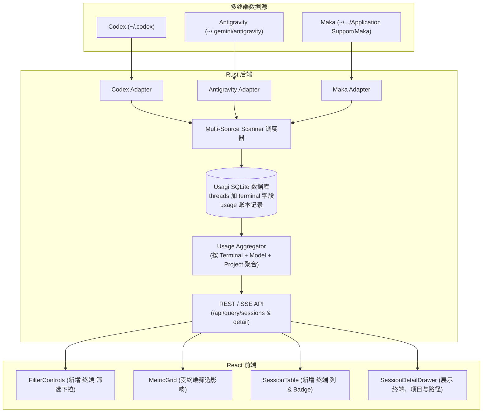

# Usagi 扩展支持 Antigravity 与 Maka 调研分析报告

本报告针对将 Usagi 从目前仅支持 OpenAI Codex 扩展至同时支持 **Antigravity** 与 **Maka** 的需求进行了完整的代码现状调研与本机真实数据目录深度探查。

---

## 一、 当前 Usagi 代码现状调研

Usagi 是一个纯本机运行、只读且注重隐私的 Rust 后端 + React 前端服务，目前整体链路紧密围绕 OpenAI Codex 的本地数据规范构建。

### 1. 后端架构现状 (`src/`)
- **数据存储 (`src/storage/`)**：
  - 基于 SQLite（采用 `rusqlite`，自研事务化迁移机制，当前为 Migration `v10`）。
  - 核心元数据表为 `threads`（记录会话主键 `thread_id`、父子派生关系 `parent_thread_id`、`root_session_id`、角色 `agent_role`、`title`、`project_name`、`project_path`、`project_kind`、`metadata_model`、时间戳等）。
  - 用量账本表为 `usage_events`、`turns` 等（记录每次模型调用的 `input_tokens`、`cached_tokens`、`cache_write_tokens`、`output_tokens`、`reasoning_tokens` 等）。
- **数据采集器 (`src/codex/`, `src/scanner/`)**：
  - 目前强绑定 Codex 数据目录（优先级：显式配置 > 环境变量 `CODEX_HOME` > 默认 `~/.codex`）。
  - 通过 `platform/file_identity.rs`（设备号 + inode）实现断点续读。
  - 元数据由 `state_5.sqlite`、`session_index.jsonl`、`.codex-global-state.json` 与 `rollout-*.jsonl` 的 session/turn context 综合推导。
- **查询与聚合层 (`src/usage/`)**：
  - 聚合结构体 `UsageFilter` 目前只支持两类筛选：`models: Vec<String>` 与 `project_paths: Vec<String>`（外加 projectless / unknown 开关）。
  - SQL 动态拼接针对 `threads` 表和 `turns` 表，尚未区分终端来源。
- **API 契约层 (`src/api/query.rs`)**：
  - `SessionUsageDto`（Session 表格行）缺少终端字段。
  - `MainSessionDetailDto`（抽屉详情）仅包含模型明细和用量，**尚未下发 `terminal`、`project_name` 和 `project_path`**。

### 2. 前端架构现状 (`frontend/src/`)
- **筛选控制 (`FilterControls.tsx`)**：
  - 当前只有「模型」与「项目」两个 `MorphPopover` 弹窗筛选器。
- **会话表格 (`SessionTable.tsx`)**：
  - 目前展示 8 列：最后活动、标题、项目、模型、合计 Token、sub数量、缓存命中率、合计费用。缺少「终端」列。
- **详情抽屉 (`SessionDetailDrawer.tsx`)**：
  - 抽屉顶部展示：`title`、`rootSessionId`、`last_activity` 时间；下方为用量收据与 Main / Subagent 折叠面板。尚未呈现会话归属的终端和项目信息。

---

## 二、 Antigravity 与 Maka 会话目录及数据对齐深度分析

经在本机（macOS）现场探查，两个客户端的数据均完整保存在本地，且能与 Usagi 当前的数据库与用量模型良好对齐。

---

### 1. Antigravity 目录与数据结构分析

- **数据根目录**：`/Users/hogee/.gemini/antigravity`
- **核心数据文件**：
  1. `conversation_summaries.db`（SQLite）：
     - 存放所有会话摘要信息。
     - 包含字段：`conversation_id`、`title`、`workspace_uris`（格式如 `["file:///Users/hogee/Desktop/PeekFlow"]`）、`status`、`last_modified_time`、`last_user_input_time`、`parent_conversation_id`、`project_id` 等。
  2. `annotations/<conversation_id>.pbtxt`：
     - 文本 Protobuf 文件，存放用户重命名后的会话标题 `title`。
  3. `conversations/<conversation_id>.db`（每个会话独立的 SQLite 数据库）：
     - 核心表 `steps`：记录会话中每个 step（`step_type = 15` 为模型响应）。
     - 字段 `metadata` 为二进制 Protobuf，内含实际用量字段（经现场反编译验证）：
       - `Sub-field 1`：模型枚举 ID（如 `1318` 对应 Gemini 3.8 Flash）。
       - `Sub-field 2`：Prompt Tokens（输入 Token）。
       - `Sub-field 3`：Output Tokens（总输出 Token）。
       - `Sub-field 5`：Cached Tokens（缓存命中 Token）。
       - `Sub-field 9`：Reasoning Tokens（思考 Token）。
       - `Sub-field 10`：Content Tokens（正文生成 Token，`9 + 10 = 3`）。
  4. `brain/<conversation_id>/.system_generated/logs/transcript.jsonl`：
     - JSONL 流式日志，记录每个 step 的执行细节与工具调用。

---

### 2. Maka 目录与数据结构分析

- **数据根目录**：`/Users/hogee/Library/Application Support/Maka`
- **核心数据文件**：
  1. `session-experience.sqlite`（顶层 SQLite）：
     - 表 `sessions`：`session_id`、`summary`（JSON 字符串）。
     - `summary` 内包含：`id`、`cwd`（项目绝对路径）、`name`（会话标题）、`model`、`thinkingLevel`、`activityAt`、`isArchived`。
  2. `workspaces/default/runtime.sqlite`（核心运行时 SQLite，**对齐度最高**）：
     - 表 `projects` & `project_locations`：精确记录项目名称与物理路径。
     - 表 `subagent_spawns`：记录 `parent_session_id` 与 `child_session_id`，天然对齐 Subagent 树形关系。
     - 表 `usage_llm_calls`：**拥有几乎与 Usagi 100% 一致的 Token 账本数据**！
       ```json
       {
         "sessionId": "a3cd5314-...",
         "modelId": "gpt-5.6-luna",
         "startedAt": 1789793173643,
         "inputTokens": 208,
         "outputTokens": 169,
         "cacheHitInputTokens": 0,
         "reasoningTokens": 148,
         "totalTokens": 377,
         "costUsd": 0,
         "ts": 1789793176510
       }
       ```

---

### 3. 数据字段对齐矩阵

| Usagi 现有字段 / 概念 | Codex 来源 | Antigravity 对应来源 | Maka 对应来源 | 对齐可行性 |
| :--- | :--- | :--- | :--- | :--- |
| **会话 ID (`thread_id`)** | `rollout.thread_id` / SQLite | `conversation_id` (UUID) | `sessionId` (UUID) | **完全对齐** |
| **父会话 ID (`parent_thread_id`)** | rollout hint / `state_5.sqlite` | `parent_conversation_id` | `subagent_spawns.parent_session_id` | **完全对齐** |
| **根会话 ID (`root_session_id`)** | 派生推导（自己或 parent 根） | 派生推导（由 parent 递归定位根） | 派生推导（由 parent 递归定位根） | **完全对齐** |
| **会话标题 (`title`)** | `session_index.jsonl` / `state_5` | `annotations/*.pbtxt` 的 `title`，降级 `conversation_summaries.title` | `sessions.summary.name` | **完全对齐** |
| **项目名称 (`project_name`)** | cwd 目录名 / Desktop 配置 | 从 `workspace_uris` URI 提取末级目录名 | `projects.name` 或 `summary.cwd` 目录名 | **完全对齐** |
| **项目路径 (`project_path`)** | `rollout.cwd` / Desktop 配置 | 从 `workspace_uris` 解析出的物理路径 | `project_locations.path` 或 `summary.cwd` | **完全对齐** |
| **项目分类 (`project_kind`)** | project / projectless / unknown | 有 `workspace_uris` 为 project，否则为 projectless | 有 `cwd` 为 project，否则为 projectless | **完全对齐** |
| **模型 (`model`)** | rollout context model | `steps` metadata 中的模型 ID 映射或设置中名称 | `usage_llm_calls.modelId` / `summary.model` | **完全对齐** |
| **活动时间 (`updated_at_ms`)** | 事件发生时间戳 | `last_modified_time` 或 steps 时间戳 | `summary.activityAt` 或 `usage_llm_calls.ts` | **完全对齐** |
| **输入 Token (`input_tokens`)** | rollout event / turn | `steps` metadata field 2 | `usage_llm_calls.inputTokens` | **完全对齐** |
| **输出 Token (`output_tokens`)** | rollout event / turn | `steps` metadata field 3 | `usage_llm_calls.outputTokens` | **完全对齐** |
| **缓存 Token (`cached_tokens`)** | rollout event cached | `steps` metadata field 5 | `usage_llm_calls.cacheHitInputTokens` | **完全对齐** |
| **思考 Token (`reasoning_tokens`)** | rollout reasoning | `steps` metadata field 9 | `usage_llm_calls.reasoningTokens` | **完全对齐** |
| **费用估算 (`estimated_cost`)** | Usagi 内置计价器按模型估算 | 传入 Antigravity 对应模型，套用计价器 | 套用计价器（也可参考记录的 `costUsd`） | **完全对齐** |

> [!NOTE]
> **结论**：Antigravity 和 Maka 的元数据、Token 用量与项目归属字段均能与 Usagi 现有的数据库及统计模型实现精确对齐。其中 Maka 原生提供了高度结构化的 SQLite 账本，解析成本最低；Antigravity 需解析其轻量 Protobuf 字段。

---

## 三、 系统改造方案分析

根据用户需求，改造涉及数据库、后端逻辑、API 契约以及前端界面四个维度。



---

### 1. 数据库改造方案

#### (1) `threads` 表改造
新增迁移文件（例如 `0011_terminal_kind.sql`）：
- 字段定义：
  ```sql
  ALTER TABLE threads ADD COLUMN terminal TEXT NOT NULL DEFAULT 'codex' 
      CHECK (terminal IN ('codex', 'antigravity', 'maka'));
  CREATE INDEX idx_threads_terminal ON threads(terminal);
  CREATE INDEX idx_threads_terminal_updated ON threads(terminal, updated_at_ms);
  ```
- 保证向下兼容：既有 Codex 数据自动成为 `'codex'`。

#### (2) 数据来源抽象
- 当前 `source_files` 与 `app_meta` 中绑定了 `codex_home_fingerprint`。
- 演进方案：
  - 增加 `source_files.terminal` 区分文件来源；
  - 或者为每个终端建立独立的状态维护键，确保各自的扫描与增量位点互不干扰。

---

### 2. 后端数据采集与查询层改造

1. **Scanner 适配器化**：
   - 将现有纯 Codex 的 Scanner 拆分出通用 trait，如 `TerminalSessionScanner`。
   - 实现三个适配器：
     - `CodexScanner`：维持原有基于 `rollout-*.jsonl` 的解析。
     - `AntigravityScanner`：读取 `conversation_summaries.db` 获取会话列表与项目，读取 `conversations/*.db` 提取 steps token 增量。
     - `MakaScanner`：读取 `runtime.sqlite` 中的 `usage_llm_calls` 和 `projects`。
   - 容错策略：若本机未安装某个客户端（如目录不存在），静默跳过，不报任何阻塞性错误。

2. **聚合与过滤层 (`UsageFilter`) 扩展**：
   - 在 `UsageFilter` 结构体中新增字段：
     ```rust
     pub struct UsageFilter {
         terminals: Vec<TerminalKind>, // codex, antigravity, maka
         models: Vec<String>,
         project_paths: Vec<String>,
         include_projectless: bool,
         include_unknown_project: bool,
     }
     ```
   - 动态 SQL 生成：在所有的统计、列表查询的 `WHERE` 条件中追加 `AND threads.terminal IN (...)`。

3. **API 契约升级 (`src/api/query.rs`)**：
   - **`SessionUsageDto`（Session 列表行）**：
     - 增加 `terminal: String`（如 `"codex"`、`"antigravity"`、`"maka"`）。
   - **`SessionDetailResponse` / `MainSessionDetailDto`（抽屉详情）**：
     - 增加 `terminal: String`；
     - 增加 `project_name: Option<String>`；
     - 增加 `project_path: Option<String>`。
   - **`FilterOptionsResponse`**：
     - 增加可用终端列表 `terminals: Vec<TerminalOption>`（附带各终端当前存在的会话数量状态）。

---

### 3. 前端界面与交互扩展方案

#### (1) 前端 Dashboard 页面支持「终端」类型筛选
- **位置**：`frontend/src/dashboard/FilterControls.tsx`
- **设计**：
  - 在「模型」和「项目」旁边新增一个终端筛选触发按钮（如带有终端图标的 `TerminalTrigger`）。
  - 弹窗内支持多选 Checkbox：
    - `[x] Codex`
    - `[x] Antigravity`
    - `[x] Maka`
  - 默认状态为全选（即展示全部终端数据）；当用户取消勾选某终端时，Dashboard 上的 8 张 KPI 卡片、Token/费用分布图表、Session 列表均联动实时筛选。

#### (2) Session 记录列表增加「终端」列
- **位置**：`frontend/src/dashboard/session/SessionTable.tsx`
- **设计**：
  - 在表格中增加「终端」列（推荐放置在「标题」与「项目」之间，宽度约 `110px`）。
  - 使用视觉徽章（Badge）展示，增强可辨识度：
    - **Codex**：绿色 / 深灰风格标签。
    - **Antigravity**：蓝色 / 紫色渐变风格标签。
    - **Maka**：橙色 / 品牌色风格标签。
  - 支持按终端列进行排序。

#### (3) 抽屉详情展示「终端」与「项目」字段
- **位置**：`frontend/src/dashboard/session/SessionDetailDrawer.tsx`
- **设计**：
  - **头部元数据区强化**：在原有会话标题、Session ID、最后活动时间的下方，增加一行元数据标签栏：
    - **终端标签**：展示带图标的终端来源徽章（Codex CLI / Antigravity / Maka）。
    - **项目信息**：清晰显示项目名称（如 `PeekFlow`），若有路径则以悬浮 Tooltip 呈现完整物理路径（`project_path`）；若为无项目会话，则标示为“独立会话（无项目）”。
  - 这样即使不同终端的项目命名方式略有差异，用户在抽屉中一眼就能明确该会话发生于哪个工具以及哪个项目。

---

## 四、 实施难点与建议

1. **Antigravity 独立数据库与 Protobuf 解码**：
   - Antigravity 采用一会话一库模式，且用量位于 Protobuf 二进制 blob 中。建议在 Rust 中编写专用的轻量 varint/wire-type 解码函数（代码量约 60~80 行，类似现场验证脚本），无需引入庞大的 protoc 编译链，性能极佳。
2. **Maka 的 SQLite WAL 锁问题**：
   - Maka 在运行时其 SQLite 文件处于频繁写入状态。Usagi 读取时必须始终使用只读打开（`SQLITE_OPEN_READONLY | SQLITE_OPEN_URI`，连接字符串加 `?mode=ro`），避免发生锁冲突。
3. **价格目录扩展**：
   - Codex 主要是 OpenAI 模型。引入 Antigravity 和 Maka 后，模型类型将扩展至 Google Gemini（如 Gemini 3.8 Flash、Gemini Pro）以及其它中转/路线模型，Usagi 的价格目录（`cost/`）需要对这部分模型配置对应的费率，以保证预估费用计算的准确性。

---

## 五、 总结

当前 Usagi 的分层架构清晰、职责明确，扩展多终端支持具有充分的可行性：
- **数据源层面**：Antigravity 与 Maka 均在 macOS 本机保存了完整的会话与用量数据，核心字段与 Usagi 现有模型能够实现 **100% 对齐**；
- **改造范围明确**：
  1. 数据库：新增迁移为 `threads` 等补充 `terminal` 字段；
  2. 后端：扩展多终端采集适配器与 `UsageFilter` 终端过滤条件，在 API 中补齐详情元数据；
  3. 前端：在 Dashboard 增加终端多选筛选器，会话列表增加终端列，抽屉详情增加终端与项目展示。

本报告阶段未改动任何代码，请审阅方案。确认后可进入具体的模块实施阶段。
