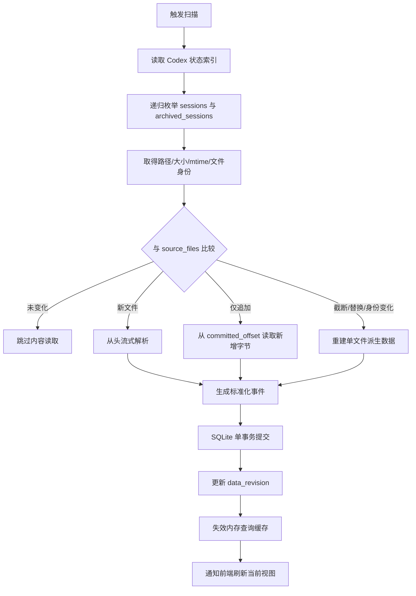
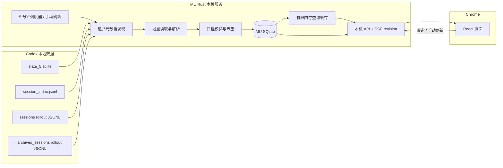

# Usagi 程序运行机制与数据持久化方案

> 版本：v0.3  
> 状态：运行机制重构方案  
> 更新日期：2026-08-05  
> 适用范围：macOS、Google Chrome、Codex 桌面端本地会话  
> 关联文档：`Usagi Codex 本地数据口径文档 v0.2`

---

## 1. 文档目标

本文重新确定 Usagi（下文简称 MU）的程序运行机制，重点解决以下问题：

1. MU 扫描哪些 Codex 本地文件；
2. MU 使用轮询、监听还是组合方式获取本地变化；
3. MU 是否建立本地数据库，以及哪些数据需要持久化；
4. 原始文件、SQLite、内存缓存与前端界面如何分别更新；
5. 如何在数据准确、资源占用、程序复杂度之间取得平衡；
6. 为什么 MU 的安装体积不应因为引入 Rust、React 和 SQLite 而显著膨胀。

本文只讨论程序运行与存储架构，不重新定义 v0.2 已确定的数据字段和统计口径。

---

## 2. 本次重构的前提变化

初期方案曾以“尽快感知 Codex 文件变化”为目标，提出持续文件监听、实时活动 Thread 集合以及无 MU 数据库的运行方式。本次重构不再继承这些前提。

### 2.1 当前真实目标

MU 当前阶段的优先级为：

1. **数据准确**：不漏记、不重复、不因文件移动或历史重放产生错误统计；
2. **运行资源低**：空闲时尽量不占用 CPU，不频繁读取磁盘；
3. **机制简单稳定**：减少同时维护多套发现、恢复和缓存逻辑；
4. **查询效率高**：Dashboard、Session、模型和时间范围查询不重复扫描原始文件；
5. **更新延迟可接受**：允许几分钟更新一次，不追求实时或 30 秒刷新。

### 2.2 本版明确取消的前提

- 不要求秒级或 30 秒级同步 Codex 数据；
- 不以文件监听作为第一版必需能力；
- 不把“当前正在运行的 Thread 数量”作为可靠实时指标；
- 不把全部 MU 状态只保存在内存；
- 不使用多个 JSON、plist 或事件缓存文件代替统一数据库。

### 2.3 本版继续保留的口径约束

- Token 数据只读取 Codex 本地 `token_count`；
- 正常统计来源是去重后的 `last_token_usage`；
- `total_token_usage` 只用于去重、缺失恢复、Turn 校验和重启恢复；
- 主 Thread、Subagent 和 `root_session_id` 的关系必须保留；
- 前端 Session 行按根 Session 聚合，Subagent 不单独生成 Session 行；
- 不复制或保存用户 Prompt、Assistant 回复和工具输出正文；
- 文件路径不能作为 Thread 或 Session 的业务主键。

---

## 3. 总体方案结论

MU 第一版采用：

```text
启动时刷新一次
+
默认每 5 分钟轮询一次
+
用户手动刷新
+
递归枚举指定目录中的文件元数据
+
未变化文件不读取内容
+
普通追加文件只读取上次位置之后的新增完整行
+
标准化事件、Thread 关系、异常和扫描游标统一写入 SQLite
+
SQLite 提交成功后更新内存查询缓存和前端界面
```

核心定位：

> MU 是一个定期扫描 Codex 本地记录、构建标准化用量账本，并为本机页面提供高效查询的本地数据服务。

本版不使用文件监听。后续只有在真实性能数据证明“定期递归枚举文件元数据”成为明显瓶颈时，才评估监听或冷热扫描优化。

---

## 4. Tokei、OpenUsage 与 MU 的机制对比

| 维度 | Tokei | OpenUsage | MU v0.3 推荐 |
|---|---|---|---|
| 产品目标 | 多工具菜单栏用量统计 | 多 Provider 额度与近期用量 | Codex 本地数据分析与 Session 查询 |
| 自动刷新 | 约 30 秒一次 | 约 5 分钟一次 | 默认 5 分钟一次，可配置 |
| 文件发现 | 定时递归枚举 | 定时递归枚举 | 定时递归枚举 |
| 文件监听 | 不作为主机制 | 不作为主机制 | 第一版不使用 |
| 未变化文件 | 复用缓存，不读正文 | 复用文件解析缓存 | 仅检查元数据，不读正文 |
| 变化文件 | 可按字节偏移读取新增内容 | 通常重新读取变化文件 | 按字节偏移读取新增完整行 |
| 持久化 | JSON/事件缓存 | UserDefaults + plist 文件缓存 | SQLite 统一账本 |
| 查询方式 | 运行时聚合 | 运行时合并缓存结果 | SQL 查询 + 少量内存缓存 |
| 适合直接借用的部分 | 文件身份、偏移、尾部校验、增量读取 | 五分钟刷新、先显示旧数据、缓存版本化 | 组合两者优点 |
| 不直接借用的部分 | 高频刷新、多文件缓存 | 变化文件完整重读、plist 分散缓存 | — |

MU 的组合原则：

- 从 **OpenUsage** 借用低频刷新和启动时先展示上次稳定结果；
- 从 **Tokei** 借用文件身份验证、完整行边界、字节级增量读取和归档去重；
- 由 **MU** 使用 SQLite 统一保存有效用量事件、Thread 关系、异常与扫描游标。

---

# 第一部分：文件扫描区域

## 5. 扫描范围

MU 只处理以下位置：

```text
$CODEX_HOME/state_5.sqlite
$CODEX_HOME/session_index.jsonl
$CODEX_HOME/sessions/**/rollout-*.jsonl
$CODEX_HOME/archived_sessions/**/rollout-*.jsonl
```

默认：

```text
CODEX_HOME = ~/.codex
```

### 5.1 `state_5.sqlite`

用途：

- Thread 主清单；
- Thread ID；
- rollout 路径；
- 创建时间与更新时间；
- 归档状态；
- 可用的标题、模型或快速总量等元数据。

限制：

- 不作为分类 Token 明细的统计来源；
- 不依赖其中可能不稳定或不完整的运行状态字段；
- MU 只通过 SQLite 只读连接查询，不直接解析数据库文件或 WAL 内容。

### 5.2 `session_index.jsonl`

用途：

- 名称补充；
- 旧版本兼容；
- 主状态索引不可用时的有限恢复。

限制：

- 不作为完整 Thread 主清单；
- 不作为 Token 来源。

### 5.3 `sessions/**/rollout-*.jsonl`

用途：

- 主 Thread 与 Subagent 元数据；
- Turn 上下文与模型；
- `token_count`；
- 生命周期与异常状态；
- 工作目录和父子关系。

### 5.4 `archived_sessions/**/rollout-*.jsonl`

用途与普通 Session 相同，但必须：

- 按 Thread ID 与普通目录去重；
- 文件从普通目录移动到归档目录时，不重复生成历史用量；
- 路径变化只改变来源位置，不改变 Thread 和 Session 身份。

### 5.5 明确不扫描的区域

第一版不递归扫描整个 `~/.codex`，也不默认读取：

- 对话之外的临时目录；
- 与当前统计无关的配置、日志和缓存；
- Codex 认证信息；
- Git 仓库全部文件；
- 用户项目源码。

如果未来增加账号额度功能，应作为独立 Provider 适配，不混入本地 Token 采集流程。

---

## 6. 递归扫描的边界

“递归”只表示进入 `sessions` 和 `archived_sessions` 的所有子目录查找目标文件，不表示读取所有文件正文。

一次常规扫描分两层：

```text
第一层：递归枚举
→ 找到 rollout 文件
→ 读取路径、大小、修改时间、文件身份

第二层：内容读取
→ 只有新文件或变化文件才打开
→ 未变化文件不读取任何 JSONL 内容
```

因此，目录中即使有大量历史文件，常规扫描也不应重新解析全部历史数据。

---

# 第二部分：本地数据获取机制

## 7. 第一版选择：低频轮询，不使用监听

### 7.1 自动刷新时机

MU 在以下时机启动一次扫描：

1. 后端进程启动；
2. 默认每 5 分钟；
3. 用户点击手动刷新；
4. 配置或 `CODEX_HOME` 发生明确变化；
5. 数据库迁移或解析器升级后需要重建。

默认刷新周期：

```text
300 秒
```

刷新间隔应允许配置，但第一版建议限制在合理范围，例如 1～60 分钟，避免用户误设为高频循环。

### 7.2 为什么不使用文件监听

监听主要解决“尽快发现变化”，但 MU 当前允许几分钟延迟。加入监听后仍必须保留轮询补漏，因此会同时维护：

- 监听事件处理；
- 事件合并和去抖；
- macOS 睡眠与恢复；
- 新目录注册；
- 文件移动和归档事件；
- 监听队列溢出；
- 漏通知后的完整校准。

这会增加代码、测试面和长期维护成本，却不会明显提高当前产品价值。

### 7.3 为什么不采用高频轮询

30 秒轮询相较 5 分钟轮询：

- 程序唤醒次数约增加 10 倍；
- 目录枚举和文件 `stat` 次数约增加 10 倍；
- 数据准确性没有本质提升；
- 只缩短页面更新延迟，而该延迟不是当前目标。

因此第一版没有必要采用 Tokei 式高频刷新。

---

## 8. 每次扫描的详细流程



### 8.1 固定扫描视图

读取变化文件前，先记录本次看到的文件大小 `observed_size`。

本轮只读取：

```text
[committed_offset, observed_size)
```

即使 Codex 在扫描过程中继续追加，也留到下一轮处理，避免一次扫描读到不断变化的边界。

### 8.2 完整行规则

JSONL 只提交以换行结束的完整记录。

如果本轮末尾是半行：

- 不解析；
- 不把游标推进到半行之后；
- 下一轮从最后一个完整换行位置重新读取。

半行内容不需要单独持久化到数据库。

### 8.3 未变化文件

满足以下条件时不打开文件正文：

- 文件身份未变；
- 文件大小未变；
- 修改时间未变；
- 解析器版本未变；
- 文件没有处于待重建状态。

### 8.4 普通追加文件

满足以下条件时执行字节级增量读取：

- 文件身份一致；
- 当前大小大于或等于旧大小；
- 旧 `committed_offset` 不大于当前大小；
- 偏移附近的 guard 校验仍然匹配；
- 文件没有被标记为截断或历史重放异常。

仅解析新增的完整 JSONL 行。

### 8.5 文件截断、替换或身份变化

出现以下情况时，不复用旧偏移：

- 当前文件大小小于旧偏移；
- 设备号或 inode 改变；
- guard 校验不匹配；
- 同一路径被新文件替换；
- 解析器版本变化使旧事件不再可信。

处理方式：

1. 标记该来源文件进入重建；
2. 删除或失效该文件生成的派生事件；
3. 重新流式解析该文件；
4. 依靠确定性 `event_id` 和数据库唯一约束避免重复；
5. 不影响其他未变化文件。

---

## 9. 首次导入与后续扫描

### 9.1 首次导入

全新的 MU 数据库需要建立历史账本，因此首次运行必须经过相关 rollout 文件。

首次导入：

- 递归枚举所有目标 rollout 文件；
- 优先导入最近日期和当前可能仍在变化的文件；
- 逐文件流式读取，不把整个历史文件集加载到内存；
- 只提取需要的记录类型；
- 用户对话正文和工具正文解析后立即丢弃，且不写入数据库；
- 页面显示导入进度和“数据仍在构建”的状态；
- 每个文件独立或分批事务提交，避免超大事务。

### 9.2 后续启动

后续启动：

```text
打开 MU SQLite
→ 立即向页面提供上次稳定数据
→ 执行一次常规扫描
→ 仅处理新增或变化文件
```

不再重读全部历史文件。

### 9.3 完整校准

常规五分钟扫描已经递归枚举全部目标文件元数据，因此不必再增加高频校准机制。

可以额外提供低频维护任务，例如每天一次：

- 清理长期不存在的来源路径记录；
- 检查数据库引用完整性；
- 执行 WAL checkpoint；
- 统计异常和数据库大小；
- 必要时运行 `PRAGMA optimize`。

维护任务不重新解析未变化的历史正文。

---

# 第三部分：数据持久化机制

## 10. SQLite 的定位

MU 建立自己的本地 SQLite 数据库。

它不是：

- Codex 对话数据库；
- 原始 JSONL 的完整镜像；
- Codex `state_5.sqlite` 的副本；
- 云端同步数据库。

它是：

> MU 根据 Codex 本地原始记录生成的、可校验且可重建的结构化派生账本。

### 10.1 两层事实来源

| 层级 | 来源 | 用途 |
|---|---|---|
| 原始事实 | Codex 状态索引和 rollout JSONL | 重建、校验、格式适配 |
| MU 查询事实 | MU SQLite 中已确认的标准化事件 | Dashboard、Session、模型与时间范围查询 |

只要原始 Codex 文件仍存在，MU SQLite 就可以重建。若用户以后选择保留历史账本，即使 Codex 清理了旧文件，MU 也可以继续保留不包含对话正文的统计结果；是否提供该保留策略应单独作为产品设置。

---

## 11. SQLite 之外需要组合的机制

SQLite 不应独自承担所有状态。推荐组合如下：

| 状态类型 | 保存位置 | 说明 |
|---|---|---|
| 标准化用量事件 | SQLite | 长期查询事实 |
| Thread/Subagent 关系 | SQLite | 聚合和恢复所需 |
| 文件身份与读取游标 | SQLite | 增量读取检查点 |
| Turn 校验与异常 | SQLite | 正确性追踪 |
| 当前文件元数据索引 | 内存 | 每轮扫描快速比较 |
| Dashboard/Session 查询结果 | 有上限的内存缓存 | 纯性能优化，可随时失效 |
| 本轮待处理文件列表 | 内存 | 一次性工作队列 |
| 用户设置 | 小型配置文件 | 刷新间隔、端口、界面偏好 |
| 错误与性能日志 | 滚动日志文件 | 限量保存，不含对话正文 |

### 11.1 不再建立第二套解析缓存

采用 SQLite 后，不再另外维护：

- 每文件 JSON 解析缓存；
- 每文件 plist 缓存；
- 独立 offset 缓存；
- Dashboard 快照 JSON；
- Session 聚合结果文件。

否则会形成两套持久化事实，需要处理同步、损坏和版本冲突。

### 11.2 内存不是事实来源

内存缓存丢失后：

- 可以从 SQLite 重新查询；
- 不应要求重新扫描全部 JSONL；
- 不影响统计结果。

---

## 12. 推荐数据库文件

默认位置示例：

```text
~/Library/Application Support/Usagi/mu.sqlite3
~/Library/Application Support/Usagi/config.toml
~/Library/Logs/Usagi/mu.log
```

数据库在 WAL 模式下可能同时出现：

```text
mu.sqlite3
mu.sqlite3-wal
mu.sqlite3-shm
```

这是 SQLite 正常运行文件，不是三套数据库。

---

## 13. 推荐表结构

以下为逻辑结构，最终字段类型和约束在数据库设计阶段确定。

### 13.1 `source_files`

记录每个 Codex 来源文件的发现和解析状态。

```text
source_file_id
thread_id
current_path
source_area                 # sessions / archived_sessions
device_id
inode
file_generation
observed_size
observed_mtime_ns
committed_offset
last_complete_line_offset
guard_hash
parser_version
scan_status
last_seen_at
last_successful_scan_at
```

关键规则：

- 路径不是业务主键；
- 文件移动后尽量保持来源身份连续；
- `committed_offset` 只指向完整行边界；
- `file_generation` 用于区分同路径的新物理文件。

### 13.2 `threads`

```text
thread_id                   # 主键
parent_thread_id
root_session_id
agent_role                  # main / subagent
title
project_name
project_path
created_at
updated_at
archived
current_rollout_path
metadata_quality_status
```

### 13.3 `usage_events`

```text
event_id                    # 确定性唯一键
occurred_at
thread_id
root_session_id
model
input_tokens
cached_tokens
cache_write_tokens
output_tokens
reasoning_tokens
total_tokens
event_kind                  # normal / recovered / turn_compensation
quality_status
source_file_id
source_start_offset
source_end_offset
created_at
```

建议索引：

```text
(occurred_at)
(thread_id, occurred_at)
(root_session_id, occurred_at)
(model, occurred_at)
(source_file_id, source_start_offset)
```

### 13.4 `turns`

```text
turn_id
thread_id
started_at
ended_at
status
start_total_snapshot
end_total_snapshot
accounted_usage
quality_status
```

Turn 表用于累计链校验和异常恢复，不要求前端直接展示全部内容。

### 13.5 `ingest_anomalies`

```text
anomaly_id
occurred_at
thread_id
source_file_id
source_start_offset
anomaly_type
severity
details_json
resolved
```

可以记录：

- Token 差值为负；
- 缓存字段超过输入；
- Reasoning 超过 Output；
- 累计链重置；
- 父子关系无法解析；
- 文件截断或替换；
- 未识别的记录格式；
- 同一 Thread 元数据冲突。

`details_json` 只能保存诊断所需结构化字段，不能复制对话正文。

### 13.6 `app_meta`

```text
schema_version
parser_version
data_revision
last_scan_started_at
last_scan_completed_at
last_full_import_completed_at
codex_home_fingerprint
```

---

## 14. SQLite 运行参数

推荐：

```sql
PRAGMA journal_mode = WAL;
PRAGMA synchronous = NORMAL;
PRAGMA foreign_keys = ON;
PRAGMA busy_timeout = 5000;
```

原则：

- 后端只有一个主要写入者；
- 页面查询通过 Rust 服务访问，不直接打开数据库；
- 写入使用短事务；
- 不为每条 JSONL 单独提交一次事务；
- 每个变化文件或一批事件组成一次可控事务；
- 定期 checkpoint，避免 WAL 无限增长。

---

## 15. 事务与一致性

### 15.1 必须同事务完成的操作

对于一批新增记录：

```text
BEGIN

插入或更新 threads
插入 usage_events
更新 turns
写入 ingest_anomalies
更新 source_files.committed_offset
增加 app_meta.data_revision

COMMIT
```

### 15.2 为什么事件和偏移必须一起提交

禁止出现：

```text
先推进读取偏移
→ 程序退出
→ 新事件没有保存
```

否则下一次扫描会从新偏移继续，导致永久漏记。

如果事务提交前退出：

- 事件和偏移都回滚；
- 下次重新读取同一段；
- `event_id` 唯一约束避免重复。

如果事务提交后退出：

- 事件和偏移都已保存；
- 下次从新位置继续。

### 15.3 `event_id` 设计

`event_id` 必须可重复计算，不能只使用随机 UUID。

可组合：

```text
文件来源身份
+ 文件 generation
+ 完整行起始偏移
+ thread_id
+ 事件类型
+ Token 快照指纹
```

相同原始事件被重复读取时，应得到相同 `event_id`。

---

# 第四部分：数据更新机制

## 16. 四层更新职责

### 16.1 Codex 原始文件层

由 Codex 自己更新：

- `state_5.sqlite`；
- `session_index.jsonl`；
- rollout JSONL。

MU 只读，不修改这些文件。

### 16.2 MU 持久化层

每次扫描：

```text
枚举元数据
→ 识别变化文件
→ 增量读取和解析
→ 生成有效用量事件
→ SQLite 事务提交
```

文件没有变化时：

- 不打开 JSONL 正文；
- 不重新计算历史聚合；
- 不写无意义的事件；
- 扫描时间可只保存在内存，或在整轮完成时仅更新一次 `app_meta`。

### 16.3 内存层

内存只保存：

- 当前扫描使用的 `source_files` 索引；
- 本轮变化文件集合；
- 当前页面高频使用的查询结果；
- 数据库连接池；
- 当前 `data_revision`；
- 有上限的 LRU 查询缓存。

SQLite 提交成功后：

1. 增加内存 `data_revision`；
2. 只失效受影响时间范围、Session 或模型的缓存；
3. 不把全部 `usage_events` 加载到内存；
4. 页面下一次查询从 SQLite 获取稳定数据。

### 16.4 前端层

页面打开时：

```text
请求当前数据
→ 立即显示 SQLite 中上次成功结果
→ 显示“最后更新于”
```

后端刷新过程中：

- 页面继续显示上一次稳定结果；
- 不清空数据；
- 可以显示轻量的“正在更新”；
- 刷新失败时保留旧数据并显示失败时间。

后端事务提交成功后：

```text
发送 data_revision 变化通知
→ 前端重新请求当前时间范围数据
```

---

## 17. 前端更新方式

### 17.1 推荐：SSE 只发送 revision

后端和浏览器之间保持一条 Server-Sent Events 连接。

提交成功时只发送：

```json
{
  "type": "data_revision_changed",
  "revision": 42,
  "updated_at": "2026-08-05T19:00:00+08:00"
}
```

前端收到后重新请求当前视图。

SSE 不承载全部 Token 数据，只作为小型失效通知，因此：

- 空闲时几乎没有网络流量；
- 不要求页面每隔几秒查询；
- 不需要 WebSocket 的双向通信复杂度；
- 与五分钟扫描并不冲突。

### 17.2 降级方案

若 SSE 断开，前端可以每 60 秒查询：

```text
GET /api/revision
```

只有 revision 变化时才重新获取数据。

### 17.3 手动刷新

用户点击刷新：

- 请求后端启动一轮扫描；
- 如果已有扫描正在执行，不重复启动第二轮；
- 页面显示当前扫描状态；
- 扫描完成后通过 revision 通知更新。

---

## 18. 查询和聚合策略

### 18.1 第一版直接查询 `usage_events`

Dashboard 和 Session 查询统一从 `usage_events` 按时间范围筛选：

```text
筛选 [start, end) 内的有效事件
→ 按字段求和
→ 按 root_session_id、model 等维度分组
→ 最后计算比例
```

不保存每个时间范围的固定 Dashboard 快照，因为：

- 今天、本周、本月、今年会随时间边界变化；
- 固定快照容易与底层事件不同步；
- 第一版数据量下，带索引查询通常足够。

### 18.2 查询缓存

内存查询缓存键可包含：

```text
数据 revision
+ 时间范围
+ 查询类型
+ 分页参数
+ 筛选参数
```

revision 变化后旧缓存自然失效。

### 18.3 后续聚合表

只有真实测试证明事件表查询明显变慢时，再增加可重建的：

```text
daily_usage_rollups
session_daily_rollups
model_daily_rollups
```

聚合表是性能优化，不是原始事实来源。

---

# 第五部分：资源占用分析

## 19. CPU 占用

### 19.1 空闲阶段

五分钟轮询模式下，大部分时间：

- 没有目录扫描；
- 没有 JSON 解析；
- 没有数据库写入；
- 仅本机 HTTP 服务和可选 SSE 连接处于等待状态。

空闲 CPU 应接近零。

### 19.2 扫描阶段

扫描 CPU 由三部分组成：

1. 目录枚举和文件元数据读取；
2. 新增 JSONL 内容解析；
3. SQLite 写入和索引维护。

采用五分钟周期后，目录枚举次数约为 30 秒方案的十分之一。

采用字节级增量读取后，日常解析量约等于过去五分钟新增的 JSONL 字节，而不是活动文件或全部历史文件的完整大小。

### 19.3 首次导入

首次导入是 CPU 和磁盘读取最高的阶段，但只发生一次或解析器重大升级后重建时发生。

控制措施：

- 流式读取；
- 限制同时解析文件数量；
- 分批事务；
- 最近文件优先；
- 页面显示进度；
- 不把全部原始记录留在内存。

---

## 20. 磁盘 I/O

| 操作 | 频率 | I/O 影响 |
|---|---:|---|
| 文件元数据枚举 | 每 5 分钟 | 低，主要是目录和 `stat` |
| 未变化 JSONL 内容读取 | 0 | 无 |
| 活动 JSONL 新增部分读取 | 每次变化后下一轮 | 与新增字节量接近 |
| SQLite 事件写入 | 每轮变化扫描 | 批量、短事务 |
| Dashboard 查询 | 页面操作时 | 只读索引查询 |
| WAL checkpoint | 低频 | 可控批量写入 |

避免：

- 每轮重读全部活动文件；
- 每条事件单独 `fsync`；
- 同时写 SQLite 和第二套 JSON/plist 缓存；
- 每次页面请求扫描原始文件。

---

## 21. 内存占用

内存不保存全部历史事件。

主要内容：

- Rust 服务运行时；
- SQLite 连接和页缓存；
- 文件元数据索引；
- 当前扫描缓冲；
- 少量 Dashboard 和 Session 查询缓存；
- React 页面在 Chrome 中的运行内存。

控制措施：

- 文件逐个或有限并发解析；
- JSONL 按行解析；
- 查询分页；
- LRU 缓存设置条目数或字节上限；
- 大型响应不长时间留在内存；
- 历史 Session 不生成永久内存对象。

---

## 22. SQLite 数据库大小

MU 不保存对话正文，只保存：

- Thread 元数据；
- 每次可信 Token 增量；
- 来源偏移；
- 少量异常信息。

因此数据库增长速度通常远低于 Codex 原始 rollout 文件。

影响数据库大小的主要因素：

- 有效模型请求次数；
- 索引数量；
- 是否长期保留旧事件；
- 异常诊断字段大小；
- WAL checkpoint 和 `VACUUM` 策略。

第一版应先保留全部本地统计事件并测量增长，不提前设置激进清理策略。

---

## 23. 不同方案的资源影响比较

| 方案 | 空闲唤醒 | 元数据扫描 | 活动文件读取 | 代码复杂度 | 数据查询成本 |
|---|---:|---:|---:|---:|---:|
| 30 秒递归轮询 + 增量读取 | 高 | 高频 | 低 | 中 | 取决于缓存 |
| 5 分钟递归轮询 + 完整重读变化文件 | 低 | 低频 | 中到高 | 低到中 | 取决于缓存 |
| 监听 + 低频轮询 + 增量读取 | 事件驱动 | 低频补漏 | 低 | 高 | 取决于持久化 |
| **MU：5 分钟轮询 + 增量读取 + SQLite** | **低** | **低频** | **低** | **中** | **低** |

本版选择最后一种，是因为它在不追求实时的前提下，以较少机制同时获得低 I/O、可恢复性和高查询效率。

---

# 第六部分：程序体积

## 24. 为什么 Tokei 和 OpenUsage 只有几 MB

Tokei 和 OpenUsage 都是原生 macOS 应用，大量基础能力来自操作系统已经安装的动态框架，例如：

- AppKit / SwiftUI；
- 文件系统与网络库；
- 系统图形和字体；
- 系统安全与钥匙串。

这些系统组件不会完整复制进应用包，因此安装包可以很小。

另外，它们没有打包一套 Chromium 浏览器内核，也没有采用 Electron。

---

## 25. MU 哪些部分会进入安装包

推荐的 MU 正式包包括：

```text
Rust release 可执行文件
编译后的 React HTML/CSS/JavaScript
SQLite 嵌入库
少量图标和静态资源
默认配置或数据库迁移脚本
```

不包括：

- Chrome 或 Chromium；
- Node.js 运行时；
- Python 运行时；
- PostgreSQL/MySQL 服务器；
- 用户的 Codex 数据库；
- 开发依赖和源码。

React 在开发阶段需要 Node.js，但正式发布时只包含构建后的静态文件。

---

## 26. Rust 为什么可能比 Swift 二进制稍大

Rust 通常会把更多依赖静态链接进可执行文件；Swift 原生应用则大量复用 macOS 的系统动态库。

因此：

- Rust 可执行文件可能比同功能 Swift 可执行文件大几 MB；
- 这不代表运行时 CPU 或内存一定更高；
- SQLite 增加的安装体积有限；
- React 静态资源通常远小于浏览器内核。

合理预期应是“几 MB 到十几 MB 级别”，而不是 Electron 常见的上百 MB。最终体积必须以第一次正式 Release 构建为准，不能用 Debug 构建判断。

---

## 27. 体积控制措施

Rust Release 建议：

```toml
[profile.release]
opt-level = "z"
lto = true
codegen-units = 1
panic = "abort"
strip = true
```

还应：

- 禁止把 Debug symbols 放入普通发布包；
- 不打包前端 source map；
- 对 JS/CSS 执行 tree shaking 和压缩；
- 不引入大型 UI 组件库和多套图标库；
- 不内嵌大型字体；
- 图片使用合理格式和尺寸；
- 避免同时引入多个功能重复的 Rust crate；
- 分别测量 Apple Silicon 和 Universal Binary 体积；
- 如无 Intel 支持要求，第一版只发布 Apple Silicon 构建会更小。

---

# 第七部分：异常与恢复

## 28. 必须覆盖的情况

- 新建 rollout 文件；
- rollout 文件正常追加；
- 文件末尾存在半行；
- 文件从 `sessions` 移动到 `archived_sessions`；
- 普通和归档目录暂时同时存在同一 Thread；
- 文件被截断；
- 同一路径文件被替换；
- MU 在事务前、事务中或事务后退出；
- Codex 在 Turn 中途退出；
- `last_token_usage` 缺失；
- 累计快照重复或重置；
- fork、Subagent 和历史重放；
- 父子关系无法解析；
- 本地记录格式发生变化；
- Codex 状态索引暂时被锁或无法读取；
- SQLite 损坏或迁移失败。

## 29. 恢复原则

1. 原始文件始终只读；
2. 单个文件异常不阻塞所有其他文件更新；
3. 不确定的数据不静默修正为 0；
4. 不能确认的事件标记异常，不进入受影响的派生比例；
5. 文件级缓存状态损坏时只重建对应文件；
6. 数据库重大损坏时允许从原始文件重建；
7. 任何重建都必须依靠确定性事件键避免重复；
8. 前端继续显示上一次成功数据，并明确标记更新时间和异常状态。

---

# 第八部分：安全与隐私边界

## 30. 本机服务

- Rust 只监听 `127.0.0.1`；
- 不监听局域网地址；
- 正式 React 页面由 Rust 本机服务提供；
- 页面不直接读取 Codex 文件；
- API 只返回展示所需的结构化数据；
- 设置修改、手动刷新等操作应校验请求来源。

## 31. 不保存的内容

MU SQLite、日志和前端缓存均不得保存：

- 用户 Prompt 正文；
- Assistant 回复正文；
- 工具输入和输出正文；
- 完整原始 JSONL；
- 从对话正文自动生成的标题或摘要；
- 用户项目源码内容。

允许保存：

- Thread ID 和关系；
- 时间戳；
- 模型；
- Token 整数；
- 项目路径；
- Codex 已有标题元数据；
- 原文件位置和字节偏移；
- 不包含正文的诊断结构。

---

# 第九部分：性能测量与决策门槛

## 32. 必须内置的性能指标

每轮扫描记录：

```text
scan_trigger
scan_started_at
scan_duration_ms
files_seen
files_new
files_changed
files_rebuilt
metadata_duration_ms
bytes_read
lines_parsed
usage_events_inserted
usage_events_deduplicated
anomalies_created
parse_duration_ms
db_write_duration_ms
frontend_revision
```

日志只保留有限天数和有限大小。

## 33. 第一版验收指标建议

以下是工程目标，不是未经测试的保证：

- 未变化文件的正文读取量为 0；
- 普通追加文件读取量接近新增字节量；
- 扫描失败不破坏上次成功数据；
- 同一批事件和游标要么同时提交，要么同时回滚；
- 普通目录和归档目录的同一 Thread 不重复统计；
- MU 重启后不需要重读全部历史文件；
- 页面打开后能先显示上次稳定数据；
- 所有 Dashboard 汇总与根 Session 聚合保持 v0.2 口径一致；
- 空闲时无高频扫描和 JSON 解析。

## 34. 何时才考虑文件监听

只有满足以下条件之一，才进入监听方案评估：

1. 文件数量增长后，每 5 分钟递归枚举耗时明显；
2. 目录元数据扫描对电量或磁盘唤醒造成可测影响；
3. 产品未来明确需要一分钟以内更新；
4. 用户频繁手动刷新，说明五分钟延迟无法满足使用场景。

即使加入监听，也应保留低频完整轮询校准，并继续使用同一套 SQLite 增量解析和事务逻辑。

---

# 第十部分：实施阶段

## 35. 阶段一：数据库与离线解析

目标：先保证统计正确，不做自动刷新。

- 建立 SQLite schema 和迁移机制；
- 实现 `state_5.sqlite` 只读适配；
- 实现两个 rollout 区域的递归枚举；
- 实现逐行解析与 v0.2 有效事件规则；
- 实现 Thread/Subagent/root Session 关系；
- 实现首次全量导入；
- 验证 Dashboard 与 Session 汇总一致性。

## 36. 阶段二：增量扫描

- 建立 `source_files`；
- 保存文件身份、大小、mtime、偏移和 guard；
- 实现未变化跳过；
- 实现追加文件只读新增字节；
- 实现截断、替换和归档移动；
- 实现事务内事件写入与偏移推进；
- 增加性能指标。

## 37. 阶段三：自动刷新与前端更新

- 启动时扫描；
- 默认五分钟扫描；
- 手动刷新；
- 防止多轮扫描并发；
- 页面先展示旧数据；
- 使用 SSE 通知 revision；
- 前端显示最后成功时间、扫描状态和错误状态。

## 38. 阶段四：性能和体积优化

- 使用真实 Codex 历史数据测试；
- 测量首次导入、常规扫描、单文件追加；
- 测量数据库增长；
- 测量前端查询延迟；
- 构建正式 Release 并统计包体；
- 根据测量结果决定是否需要聚合表、冷热扫描或监听。

---

# 第十一部分：最终决策表

| 决策项 | v0.3 结论 |
|---|---|
| 是否追求实时 | 否 |
| 默认更新间隔 | 5 分钟 |
| 是否支持手动刷新 | 是 |
| 是否文件监听 | 第一版否 |
| 是否递归扫描 | 是，只扫描两个指定会话区域 |
| 是否每轮重读历史文件 | 否 |
| 变化文件读取方式 | 普通追加只读新增完整行 |
| 是否建立 MU SQLite | 是 |
| SQLite 保存什么 | 有效事件、Thread 关系、异常、来源文件和游标 |
| 是否另建 JSON/plist 解析缓存 | 否 |
| 内存保存什么 | 文件索引、扫描队列、有限查询缓存 |
| 配置保存方式 | 小型配置文件 |
| 日志保存方式 | 限量滚动日志 |
| 前端初始数据 | SQLite 中上次成功结果 |
| 前端更新通知 | SSE revision，失败时轮询 revision |
| 是否保存对话正文 | 否 |
| 首次运行是否扫描历史 | 是，流式导入一次 |
| 后续启动是否全量解析 | 否 |
| 程序打包方式 | Rust Release + React 静态资源，不打包浏览器/Node/Python |

---

## 39. 推荐架构总图



---

## 40. 一句话方案

> MU 第一版使用五分钟低频递归轮询发现 Codex 文件变化，以文件身份和字节游标只读取新增完整行，将标准化用量事件、Thread 关系、异常和扫描进度统一事务化保存到 SQLite；内存只做有限查询加速，前端先显示上次稳定数据，并在数据库 revision 变化后重新取数。
